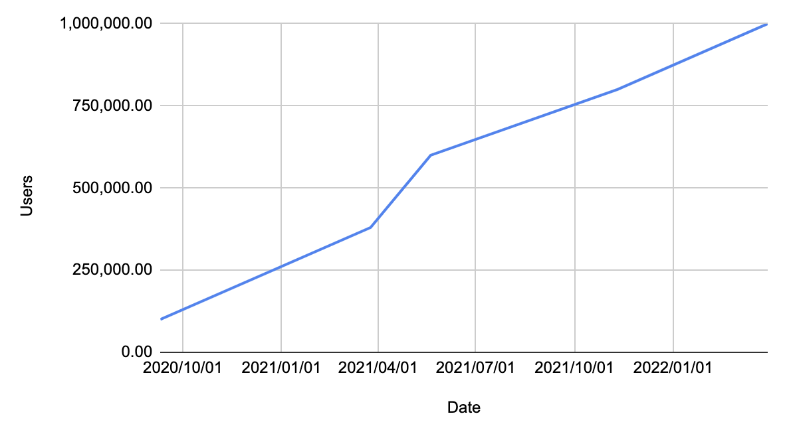
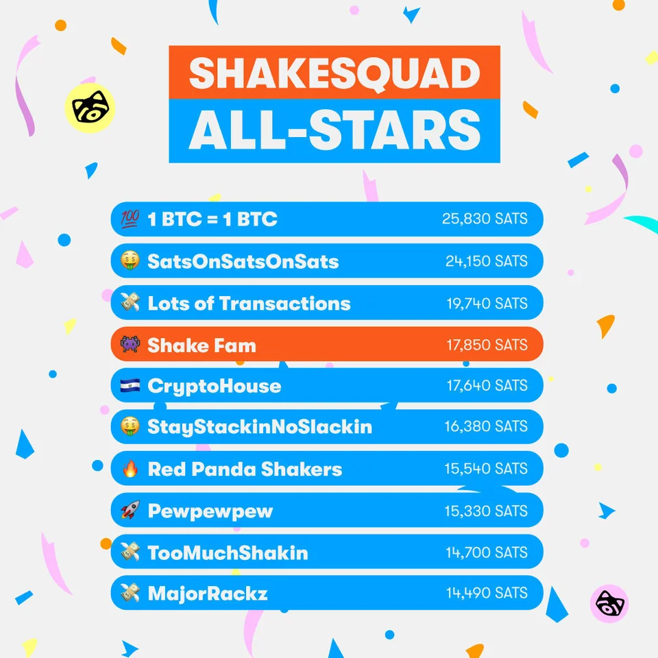

# Shakepay: Simple Crypto Success

### Assignment 01: Case Study
*by Juil Yoon for* ***UofT Fintech Bootcamp 2022***
due Thursday 2022/11/24

## Overview and Origin

**Name:** Shakepay Inc.

**Website:** [shakepay.com](https://shakepay.me/r/TPTYVWE)

**Founded:** 2015  
**Incorporated:** 2017/01/17

**Founders:**  
Jean Amiouny - CEO  
Roy Breidi - CTO

[Contact](https://shakepay.com/about?lang=en)

**Funding:**  
Last funding round: Series A  
Total funding amount: **$36M**  
[Crunchbase](https://www.crunchbase.com/organization/shakepay)

**Origin:**  
Originally launched through the BoostVC accelerator in 2015 as a way to load a credit card with bitcoin and spend it in physical retail stores, Shakepay had to pivot quickly when their partner bank and VISA ended their partnership. The solution? Skip a couple steps in their business plan and launch a bitcoin exchange.

Now, 4 years after launching the Shakepay bitcoin exchange, the company has also released a digital VISA credit card that can spend the same $CAD in the account you use to purchase bitcoin, almost coming full circle to the founders' original vision.

*([Brainstation Magazine](https://brainstation.io/magazine/the-fast-and-the-frictionless-building-a-cryptocurrency-exchange-with-shakepay))*

**Industries:** Bitcoin, Fintech, Payments

## Business Activities:

### Problem Being Solved

#### Buying Bitcoin & Self-Custody
Shakepay as an exchange makes it as easy as possible to purchase bitcoin (and ethereum) and move it off the app to self-custody for Canadians.
* The exchange has no buy or sell fees but has a small trading margin for revenue while still maintaining prices at or very close to the market price.
* Canadians can instantly deposit and withdraw $CAD into their account using Interac e-transfers.
* Shakepay covers all transaction fees incurred when moving BTC off the app.

#### Spending Bitcoin in the Real World
There aren't many good ways to spend one's bitcoin in the real world unless a retail story intentionally goes through the trouble of setting up a custom terminal.
* The app has a digital prepaid VISA credit card that can be added to digital wallets (ex. Google Wallet, ApplePay) and then tapped in physical retail stores to pay for goods & services.
* Since the app is also an exchange, BTC and ETH can be sold anytime to top up the balance of the card.
* $CAD balance in the app earns 4% interest.

### Customer

**Target Market:** Canadian, casual crypto-user, wide adoption

**Market Size:** 28 million Canadian adults

### Solution

#### Tech Stack

**Crypto:**  
- Bitcoin & Ethereum networks
- Coinbase Custody in cold storage

**Financial:**  
- Interac e-transfer
- VISA Payment
- Mobile wallet integration (Google Wallet, Apple Pay)

**Application:**  
- Cloudflare
- vue.js, animate.css, Bulma
- [Stackshare](https://stackshare.io/shakepay/shakepay)

#### Unfair Advantage
Because Shakepay only offers BTC and ETH, they are able to offer products with less regulatory scrutiny (SEC chair Gary Gensler confirms that [Bitcoin is not a security](https://decrypt.co/103926/sec-chair-gensler-bitcoin-not-security-what-about-ethereum), one of the only "crypto-currencies" to have such solid confirmation).

Being Canadian, Shakepay is able to integrate instant e-transfer of $CAD in and out of users' accounts. This also means that users do not have to rely on or pay fees for using other transaction methods like wire transfers.

Among its competitors, Shakepay is the only crypto app or CEX (centralized exchange) that offers:  
- unlimited no-fee withdrawals
- daily shake rewards ($sats)
- #shakepaid: a lottery-system that randomly refunds an entire Shakepay VISA purchase in sats

These are all loss-leaders, but Shakepay has garnered a very loyal base of **daily active users**, some of whome have accumulated millions in free sats.

## Landscape:

**Industry Domains:** Bitcoin, Fintech, Payments

### Industry Trends

| Domain            	| Last 5 Years                                                                                                        	| Last 10 Years                                	|
|-------------------	|----------------------------------------------------------------------------------------------------------------------	|-----------------------------------------	|
| Bitcoin           	| Bitcoin ETFs (Canada),  ASIC mining,  renewable energy mining,  leveraged trading,  collateralized loans 	| Bitcoin mining, self-custody         	|
| Crypto Currencies 	| NFTs, dApps, Risky high-yield yield farming,  collateralized loans,  Ponzi schemes                          	| crypto mining,  low transaction fees 	|
| Payments          	| Mobile wallets,  Buy-now pay-later                                                                                	| Interac e-transfers,  NFC tap        	|
| Fintech           	| App-only banking,  automatic investments,  all personal finance integration                                    	| Minimalist UI,  mobile appps         	|

-*See [Sources](#Sources) for more details.*

### Competitors

#### Canada
- [Newton](https://web.newton.co/r/9RXNPI)
- [Coinsquare](http://coinsquare.com/register?r=d7jPJ)
- [Wealthsimple](https://my.wealthsimple.com/app/public/trade-referral-signup?code=DR3KXW)

#### International
- [Crypto.com](https://crypto.com/app/qwjkk823yf)
- [Coinbase](https://www.coinbase.com/)
- [Cake Defi](https://cakedefi.com/?ref=780045)
- [Kraken](https://www.kraken.com/)
- Bankrupt: ~~FTX, Blockfi, Celsius~~

## Results

*Shakepay is a private company so most standard business metrics are not readily available quarter to quarter.*

### Impact #TODO

### Key Metrics

#### 1. Users
**Performance:**  
Shakepay has seen linear growth in numbers over the last couple years but the slope has been very steep with a 163% year-over-year increase in March 2022.

Users are also very active due to Shakepays **#ShakingSats** program that pays each user a small, incrementally increasing (based on daily streak), reward in sats for shaking your phone once a day.

**History:**  
- 1,000,000 users [2022/03/30](https://blog.shakepay.com/one-million-shakers/)
- 800,000 users [2021/11/10](https://blog.shakepay.com/2-of-canadians-are-now-using-shakepay/)
- 600,000 users [2021/05/20](https://blog.shakepay.com/600-000-canadians-now-on-shakepay/) 	
- 380,000 users [2021/03/25](https://blog.shakepay.com/1-of-canadians-are-now-on-shakepay/)
- 100,000 users [2020/09/10](https://blog.shakepay.com/were-100-000-shakers-strong/)

#### 2. Trading Volume
**Performance:**  
Shakepay consistently has one of the lowest costs for Canadians trading Bitcoin (see [Cryptolens](https://cryptolens.ca/)). This is on top of having free deposits/withrawals through Interac eTransfer and no trading fees (though there is a spread).

Shakepay was also one of the first to implement recurring buys (daily, weekly, monthly purchase of the same amount) in Canada allowing users to dollar-cost-average into BTC and ETH which are extremely volatile assets.

**History:**  
Unfortunately, since Shakepay is still a private company, they do not publish all details such as trading volume to the public. However, considering there are consistently new [job openings](https://shakepay.com/careers?lang=en#openings) advertised on their website, it seems they are generating significant revenue, which mostly comes from the buy/sell spread.

#### 3. Visa Transactions
**Performance:**  
A [#ShakeSquad](https://help.shakepay.com/en/articles/6280233-introducing-shakesquads) is composed of 4 Shakepay users that earned $sats daily based on the cumulative number of Visa card transactions from the group. Each member earns 42 bonus sats for each transaction. This means the top 10 groups during the week of Nov 11, 2022 (see data below) made an average of 108 transactions person. Americans make [an average 41 payments per month](https://fortunly.com/statistics/cash-versus-credit-card-spending-statistics/), meaning this group of Shakepay users were making double the average number of transactions using their Shakepay Visa card.  
([Spreadsheet](https://docs.google.com/spreadsheets/d/1SZp5FE3jvfNfD-ABra0b5Q5SFewMrxFQunLCnv4jviY/edit?usp=sharing))

**History:**  
- Same issue as [Trading Volume](#2.-Trading-Volume): limited public data, but we will work with what we have.
- [2022/11/16](https://www.reddit.com/r/shakepay/comments/yxa0xs/weekly_shakesquad_leaderboard_coming_in_good_to/): Weekly ShakeSquad leaderboard of sats earned.  
Top 10 teams earned 18,165 sats on average this week.

- [2022/02/08](https://blog.shakepay.com/thanks-to-you-shakepay-sent-donations-to-the-mooooooon/): Shakepay users made at least 468,000 transactions using the Shakepay prepaid visa card between Dec 2021 - Feb 2022

### Compared to the Competition

#### Users
- Newton had 200,000 users in [May 2021](https://www.newton.co/blog/200k-users). Shakepay had 3x that number at the same time period.
- Wealthsimple passsed 2,000,000 users in [May 2021](https://www.businessinsider.com/wealthsimple-hits-2-million-canadian-users-amid-neobanking-push-2021-5). This is 3x Shakepay's user base at the same time. However, Wealthsimple as a service focused more on ETF investing and stock trading before adding crypto capabilities to their product, and the number of users who actually buy/sell crypto on Wealthsimple is unknown.
- Crypto.com had 10 million users worldwide in [March 2021](https://www.newswire.ca/news-releases/crypto-com-visa-card-spending-grew-55-per-user-in-2020-online-spending-up-117--852927029.html). The biggest user base is in teh US and UK, while Canadian data is not broken down separately.

#### Unique Features

There are currently no Canadian companies offering a crypto enabled credit card besides Shakepay. They are market leaders in this aspect. Crypto.com currently offers a similar prepaid Visa credit card to Canadians, but it requires a [$5000 stake of the CRO token](https://crypto.com/us/cards) in order to get similar benefits (which will be ending in 2023)

Because Shakepay only offers BTC and ETH on its exchange, they are also able to offer zero fee buys & sells with low spreads. (See [CryptoLens](https://cryptolens.ca/))

Shakepay recently started offering [4% APY](https://blog.shakepay.com/win-at-waiting-for-shakepay-earn/) on a Canadian Dollar balance (up to $1000). Nobody is offering such competitive rates, especially not on Canadian dollars and particularly without having to lock it up.

## Recommendations

### Collateralized Spending Credit
Crypto.com currently offers a [collateralized spending credit](https://crypto.com/product-news/spending-power-is-now-available-in-canada) on their prepaid Visa card. It should be fairly straightforward to offer a similar feature to Shakepay card users.

**Benefits:** Although this goes against the ethos of self-custody, the feature would encourage more users to keep their assets on the app and increase Shakepay's assets-under-management (AUM). Shakepay could also increase revenue by charging interest on credit balances.

**Technology:** This feature would not require much more technology to implement.

### Bitcoin & Ethereum Staking
Users would be able to stake BTC and ETH as a pool to earn yield on their crypto without the technological literacy needed to setup a defi wallet and stake in a protocol or having to research which protocols are reliable.

**Benefits:** Same as [collateralized spending](#collateralized-spending-credit).

**Technology:** Would require a defi integration.

## Sources

- [About Shakepay](https://shakepay.com/about?lang=en)
- [FINTRAC](https://www10.fintrac-canafe.gc.ca/msb-esm/public/detailed-information/msb-details/7b226d73624f72674e756d626572223a3134393737362c227072696d617279536561726368223a7b226f72674e616d65223a227368616b65706179222c2273656172636854797065223a337d7d/)
- [Crunchbase](https://www.crunchbase.com/organization/shakepay/)
- [StatCan](https://www12.statcan.gc.ca/census-recensement/2011/dp-pd/prof/details/page.cfm?Lang=E&Geo1=PR&Code1=01&Geo2=PR&Code2=01&Data=Count&SearchText=Canada&SearchType=Begins&SearchPR=01&B1=All&Custom=&TABID=1)
- [Stackshare](https://stackshare.io/shakepay/shakepay)
- [Brainstation Magazine](https://brainstation.io/magazine/the-fast-and-the-frictionless-building-a-cryptocurrency-exchange-with-shakepay)
- [decrypt - SEC Chair Gensler Again Says Bitcoin Is Not a Security. What About Ethereum?"](https://decrypt.co/103926/sec-chair-gensler-bitcoin-not-security-what-about-ethereum)
- [Ethereum Foundation - DAPPS](https://ethereum.org/en/dapps/) 
- [Hut8 - Investors/ESG](https://hut8mining.com/investors/environmental-social-and-governance/)
- [Cryptolens - Canadian Bitcoin purchase rates](https://cryptolens.ca/)
- [Fortunly - Average US Credit Card Use](https://fortunly.com/statistics/cash-versus-credit-card-spending-statistics/)
- [Shakepay Earn](https://blog.shakepay.com/win-at-waiting-for-shakepay-earn/)
- [Business Insider - Wealthsimple users](https://www.businessinsider.com/wealthsimple-hits-2-million-canadian-users-amid-neobanking-push-2021-5)
- [Newswire - Crypto.com visa card spending](https://www.newswire.ca/news-releases/crypto-com-visa-card-spending-grew-55-per-user-in-2020-online-spending-up-117--852927029.html)
- [Crypto.com Visa Cards](https://crypto.com/us/cards)
