# Getting Familiar with the Terminal

In this activity, we're going to be practicing a bit more with terminal commands.

## Solution

1. To start with, let's open up the terminal in this folder.

    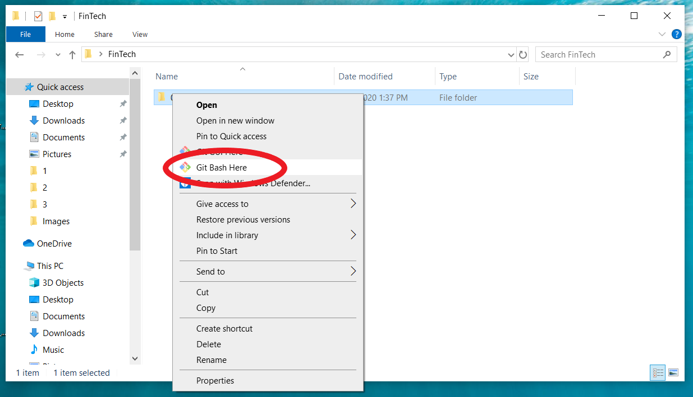

2. Let's see what's in the folder! Use the `ls` command to see the contents of this folder.

    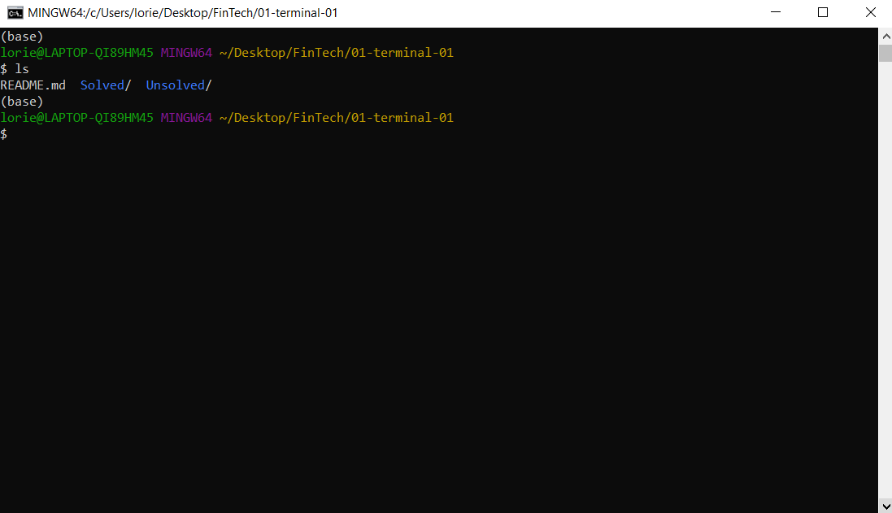

3. What's the current path we're in? Let's find out with the `pwd` command.

    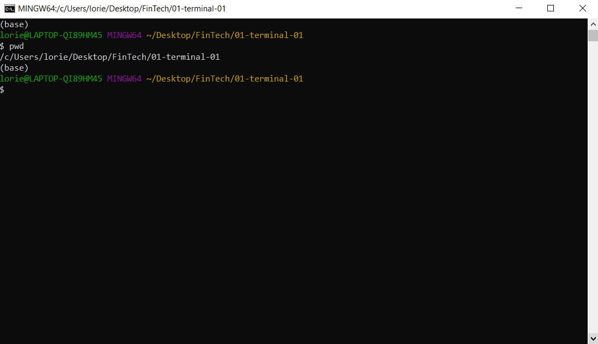

    **Note:** Notice that the path you're currently at is the folder where you right clicked to start git bash.

4. Make a new directory named `Activity-1` and then list the contents of the current directory again to make sure it worked.

    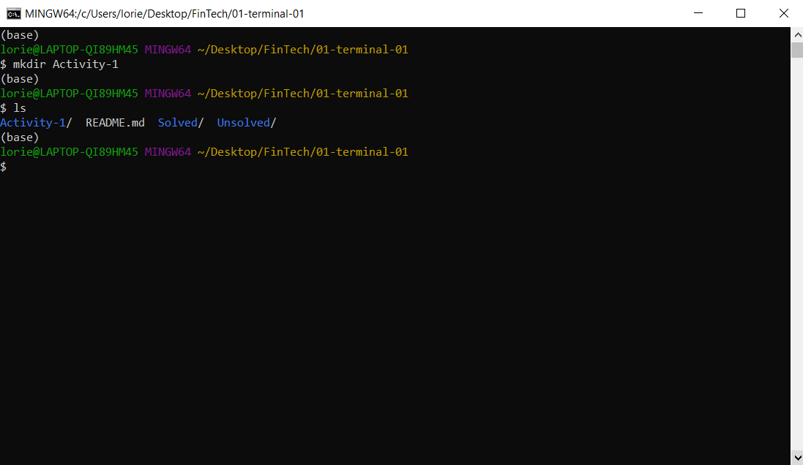

5. Navigate into the directory we just made.

    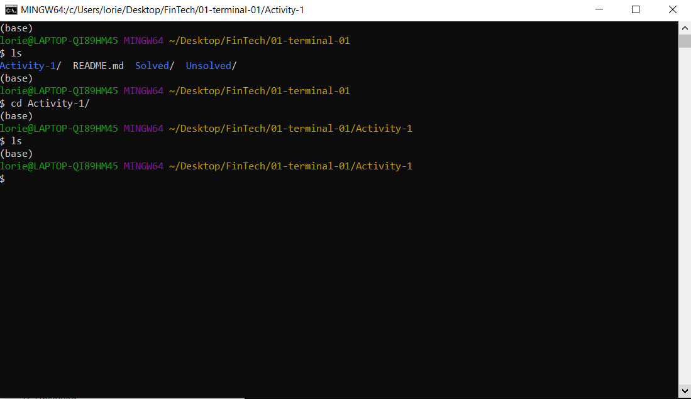

6. Make a new file named `hello.md` and then list the contents of the current directory again.

    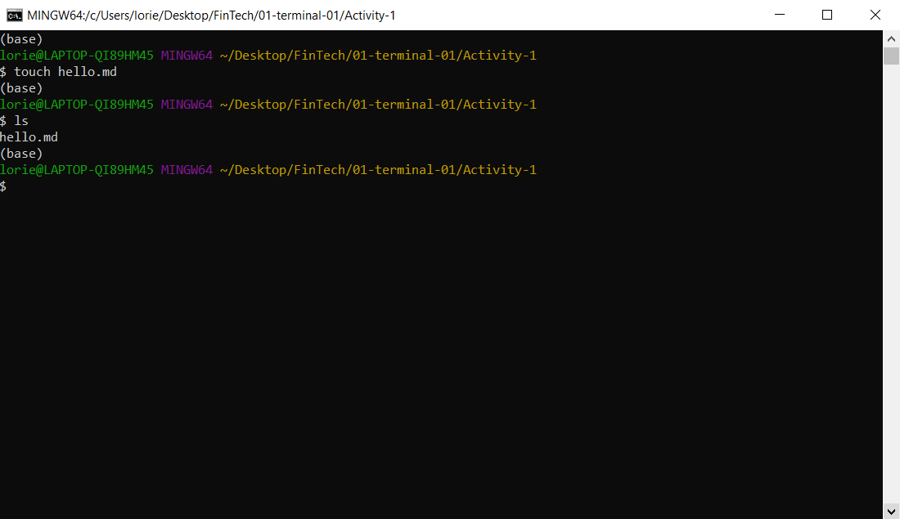

7. Copy the file you just made to a filed named `world.md`.

    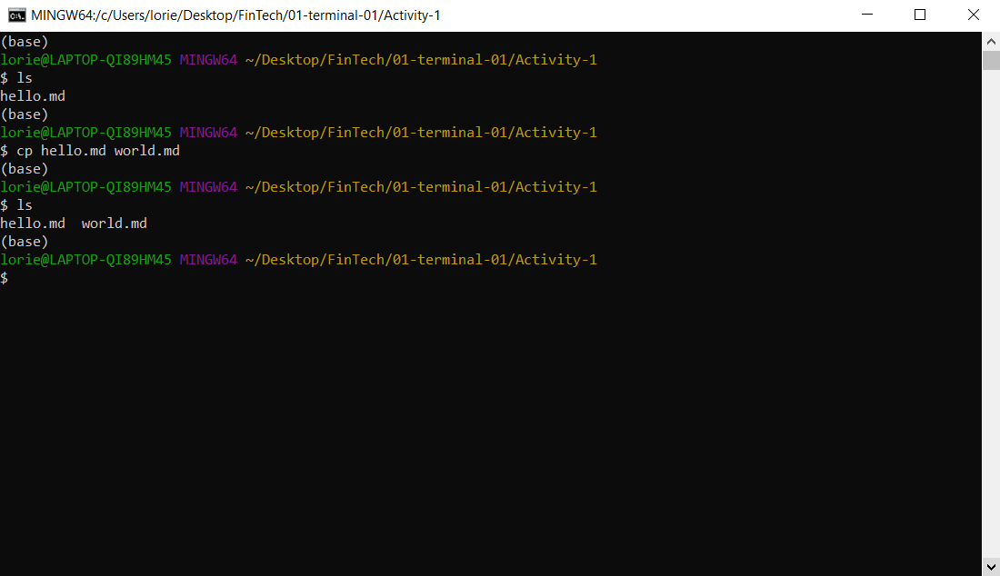

8. Rename the `hello.md` file to `coding.md`.

    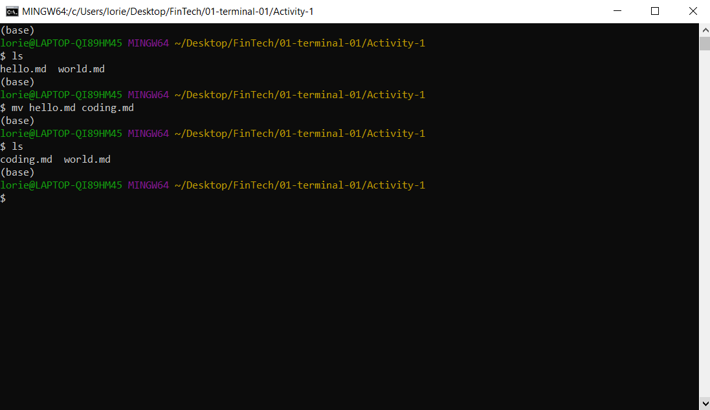

9. Make a new directory named `terminal`.

    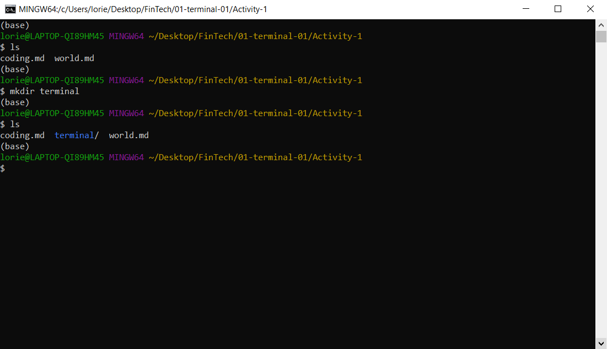

10. Move the `world.md` file into the `terminal` folder we just made.

    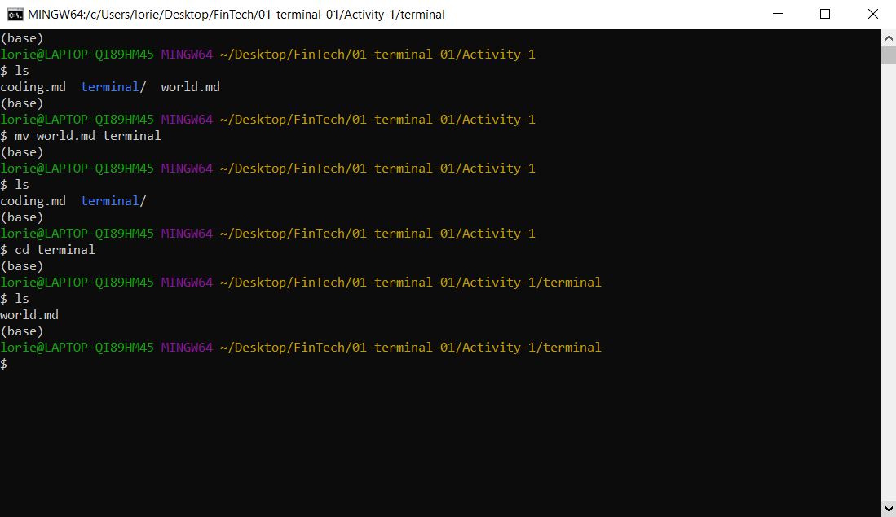

11. Delete the `terminal` folder.

    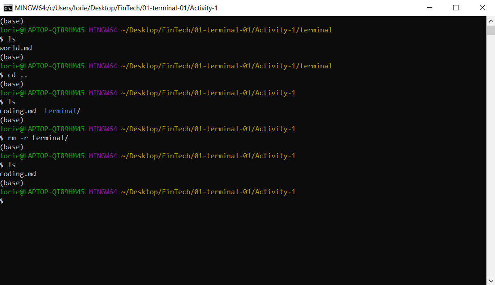

## Hints

Use the [terminal cheat sheet](../Unsolved/Terminal-Cheatsheet.md) to help guide you on which terminal commands should be used for each step.
