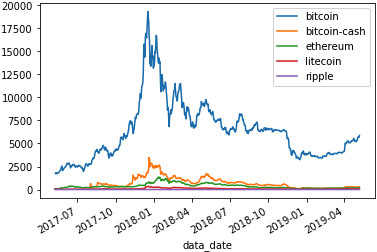

# Group Dynamics

The cryptocurrency market has experienced yet another wave of activity–everyone's talking about Bitcoin and Ethereum. Family and close friends are bombarding you with questions, requests for information, and investing advice. However, it's been two years since you looked at your crypto wallet holdings, and your knowledge of current-day crypto trends is lacking.

It's time you brushed up on the price dynamics of each crypto. Conduct a price analysis for Bitcoin, Ethereum, Bitcoin Cash, Ripple, and Litecoin to assess average, high, and low prices for each cryptocurrency. Determine whether or not crypto's performance in the past two years warrants future investment.

## Instructions

Use the starter file and the historical stock data provided to complete the following steps:

1. Load CSV data into Pandas using `read_csv`.

2. Assign the index as series `data_date`. Be sure to provide the `parse_dates` and `infer_datetime_format` arguments.

3. Drop columns `data_time` and `timestamp` and clean missing values.

4. Plot grouped data on the same chart and return `data_price`.

    

5. Calculate `average` price across two years for each `cryptocurrency`.

6. Calculate `max` price across two years for each `cryptocurrency`.

7. Calculate `min` price across two years for each `cryptocurrency`.

8. Answer the following question:

    * What does the data say about crypto performance in the past two years? 

---

© 2022 edX Boot Camps LLC. Confidential and Proprietary. All Rights Reserved.
