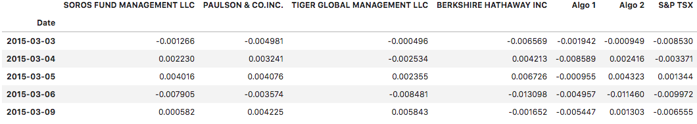

# Unit 4 Homework Assignment: A Whale Off the Port(folio)

## Background

Harold's company has been investing in algorithmic trading strategies. Some of the investment managers love them, some hate them, but they all think their way is best.

You just learned these quantitative analysis techniques with Python and Pandas, so Harold has come to you with a challenge—to help him determine which portfolio is performing the best across multiple areas: volatility, returns, risk, and Sharpe ratios.

You need to create a tool (an analysis notebook) that analyzes and visualizes the major metrics of the portfolios across all of these areas, and determine which portfolio outperformed the others. You will be given the historical daily returns of several portfolios: some from the firm's algorithmic portfolios, some that represent the portfolios of famous "whale" investors like Warren Buffett, and some from the big hedge and mutual funds. You will then use this analysis to create a custom portfolio of stocks and compare its performance to that of the other portfolios, as well as the larger market ([S&P TSX 60 Index](https://en.wikipedia.org/wiki/S%26P/TSX_60)).

For this homework assignment, you have three main tasks:

1. [Read in and Wrangle Returns Data](#Prepare-the-Data)

2. [Determine Success of Each Portfolio](#Conduct-Quantitative-Analysis)

3. [Choose and Evaluate a Custom Portfolio](#Create-a-Custom-Portfolio)

---

## Instructions

**Files:**

* [Whale Analysis Starter Code](Starter_Code/whale_analysis.ipynb)

* [algo_returns.csv](Starter_Code/Resources/algo_returns.csv)

* [otex_historical.csv](Starter_Code/Resources/otex_historical.csv)

* [sp_tsx_history.csv](Starter_Code/Resources/sp_tsx_history.csv)

* [l_historical.csv](Starter_Code/Resources/l_historical.csv)

* [shop_historical.csv](Starter_Code/Resources/shop_historical.csv)

* [whale_returns.csv](Starter_Code/Resources/whale_returns.csv)

### Prepare the Data

First, read and clean several CSV files for analysis. The CSV files include whale portfolio returns, algorithmic trading portfolio returns, and S&P TSX 60 Index historical prices. Use the starter code to complete the following steps:

1. Use Pandas to read the following CSV files as a DataFrame. Be sure to convert the dates to a `DateTimeIndex`.

    * `whale_returns.csv`: Contains returns of some famous "whale" investors' portfolios.

    * `algo_returns.csv`: Contains returns from the in-house trading algorithms from Harold's company.

    * `sp_tsx_history.csv`: Contains historical closing prices of the S&P TSX 60 Index.

2. Detect and remove null values.

3. If any columns have dollar signs or characters other than numeric values, remove those characters and convert the data types as needed.

4. The whale portfolios and algorithmic portfolio CSV files contain daily returns, but the S&P TSX 60 CSV file contains closing prices. Convert the S&P TSX 60 closing prices to daily returns.

5. Join `Whale Returns`, `Algorithmic Returns`, and the `S&P TSX 60 Returns` into a single DataFrame with columns for each portfolio's returns.

    

### Conduct Quantitative Analysis

Analyze the data to see if any of the portfolios outperform the stock market (i.e., the S&P TSX 60).

#### Performance Analysis

1. Calculate and plot daily returns of all portfolios.

2. Calculate and plot cumulative returns for all portfolios. Does any portfolio outperform the S&P TSX 60?

#### Risk Analysis

1. Create a box plot for each of the returns. 

2. Calculate the standard deviation for each portfolio. 

3. Determine which portfolios are riskier than the S&P TSX 60

4. Calculate the Annualized Standard Deviation.

#### Rolling Statistics

1. Calculate and plot the rolling standard deviation for all portfolios using a 21-day window.

2. Calculate and plot the correlation between each stock to determine which portfolios may mimick the S&P TSX 60.

3. Choose one portfolio, then calculate and plot the 60-day rolling beta for it and the S&P TSX 60.

#### Rolling Statistics Challenge: Exponentially Weighted Average

An alternative method to calculate a rolling window is to take the exponentially weighted moving average. This is like a moving window average, but it assigns greater importance to more recent observations. Try calculating the [`ewm`](https://pandas.pydata.org/pandas-docs/stable/reference/api/pandas.DataFrame.ewm.html) with a 21-day half-life.

### Sharpe Ratios

Investment managers and their institutional investors look at the return-to-risk ratio, not just the returns. After all, if you have two portfolios that each offer a 10% return, yet one is lower risk, you would invest in the lower-risk portfolio, right?

1. Using the daily returns, calculate and visualize the Sharpe ratios using a bar plot.

2. Determine whether the algorithmic strategies outperform both the market (S&P TSX 60) and the whales portfolios.

### Create a Custom Portfolio

Harold is ecstatic that you were able to help him prove that the algorithmic trading portfolios are doing so well compared to the market and whales portfolios. However, now you are wondering whether you can choose your own portfolio that performs just as well as the algorithmic portfolios. Investigate by doing the following:

1. Visit [Google Sheets](https://docs.google.com/spreadsheets/) and use the built-in Google Finance function to choose 3-5 stocks for your portfolio.

2. Download the data as CSV files and calculate the portfolio returns.

3. Calculate the weighted returns for your portfolio, assuming equal number of shares per stock.

4. Add your portfolio returns to the DataFrame with the other portfolios.

5. Run the following analyses:

    * Calculate the Annualized Standard Deviation.
    * Calculate and plot rolling `std` with a 21-day window.
    * Calculate and plot the correlation.
    * Calculate and plot the 60-day rolling beta for your portfolio compared to the S&P 60 TSX.
    * Calculate the Sharpe ratios and generate a bar plot.

4. How does your portfolio do?

**Note:** In the Resources folder, you'll find CSV files for OTEX, L and SHOP. These are provided as a backup in the event that the Google Finance function is not functioning properly.

---

## Resources

* [Pandas API Docs](https://pandas.pydata.org/pandas-docs/stable/reference/index.html)

* [Exponential weighted function in Pandas](https://pandas.pydata.org/pandas-docs/stable/reference/api/pandas.DataFrame.ewm.html)

* [`GOOGLEFINANCE` function help](https://support.google.com/docs/answer/3093281)

* [Supplemental Guide: Fetching Stock Data Using Google Sheets](../../../01-Lesson-Plans/04-Pandas/Supplemental/googlefinance_guide.md)

---

## Hints

* After reading each CSV file, don't forget to sort each DataFrame in ascending order by the Date using `sort_index`. This is especially important when working with time series data, as we want to make sure Date indexes go from earliest to latest.

* The Pandas functions used in class this week will be useful for this assignment.

* Be sure to use `head()` or `tail()` when you want to look at your data, but don't want to print to a large DataFrame.

---

## Submission

1. Use the provided starter Jupyter Notebook to house the code for your data preparation, analysis, and visualizations. Put any analysis or answers to assignment questions in raw text (markdown) cells in the report.

2. Submit your notebook to a new GitHub repository.

3. Add the URL of your GitHub repository to your assignment when submitting via Bootcamp Spot.

---

### Requirements

#### Data Preparation  (20 points)

##### To receive all points, you must:

* Use Pandas to read each CSV file in as a DataFrame. (3 points)
* Detect and remove all null values. (4 points)
* Convert the S&P 500 closing prices to daily returns. (5 points)
* Join the Whale Returns, Algorithmic Returns, and the S&P 500 Returns into a single DataFrame with columns for each portfolio's individual returns. (8 points)

#### Quantitative Analysis (20 points)

##### To receive all points, your code must:

* Calculate and plot the daily and cumulative returns of all portfolios. (2 points)
* Create a box plot for each of the returns. (2 points)
* Calculate the standard deviation for each portfolio. (2 points)
* Determine which portfolios are riskier than the S&P 500. (3 points)
* Calculate the annualized standard deviation for each portfolio. (2 points)
* Calculate and plot the rolling standard deviation for all portfolios using a 21-day window. (3 points)
* Calculate and plot the correlation between each stock to determine which portfolios may mimic the S&P 500. (3 points)
* Choose one portfolio, then calculate and plot it's beta as compared to the S&P 500. (3 points)

#### Sharpe Ratios (15 points)

##### To receive all points, your code must:

* Use the daily returns to calculate the Sharpe ratios. (4 points)
* Visualize the Sharpe ratios using a bar plot. (3 points)
* Determine whether the algorithmic strategies outperform both the market (S&P 500) and the whales portfolios. (8 points)

#### Custom Portfolio (15 points)

##### To receive all points, your code must:

* Use the Google Finance function to choose a portfolio. (3 points)
* Download the data needed as CSV files and calculate the portfolio returns. (4 points)
* Add the portfolio returns to the DataFrame with the other portfolios, then analyze and compare all portfolios. (8 points)

#### Coding Conventions and Formatting (10 points)

##### To receive all points, your code must:

* Place imports at the beginning of the file, just after any module comments and docstrings and before module globals and constants. (3 points)
* Name functions and variables with lowercase characters and with words separated by underscores. (2 points)
* Follow Don't Repeat Yourself (DRY) principles by creating maintainable and reusable code. (3 points)
* Use concise logic and creative engineering where possible. (2 points)

#### Deployment and Submission (10 points)

##### To receive all points, you must:

* Submit a link to a GitHub repository that’s cloned to your local machine and contains your files. (5 points)
* Include appropriate commit messages in your files. (5 points)

#### Code Comments (10 points)

##### To receive all points, your code must:

* Be well commented with concise, relevant notes that other developers can understand. (10 points)

---

© 2022 edX Boot Camps LLC. Confidential and Proprietary. All Rights Reserved.
