# Alpaca Markets (python-sdk) and Nasdaq API Installation Guide

This guide serves as a step by step process for setting up and validating the packages and files needed to utilize the Alpaca Markets API/Python SDK and the Nasdaq API. Without proper installation and set up, class activities and code will not extract historical stock data and therefore, cannot be completed.

---

## Install

* Open a new terminal window.

* All packages should be installed into the `alpacaenv` virtual environment.  To create the `alpacaenv` virtual environment, run the following command in your terminal, answering `y` when prompted:

  ```shell
  conda create -n alpacaenv python=3.7 anaconda
  ```

* After the `alpacaenv` environment installation is complete, activate it by typing the following command:

  ```shell
  conda activate alpacaenv
  ```

* Next, install the `python-dotenv` package by running the following command in your terminal:

  ```python
  pip install python-dotenv
  ```

* Now, initiate the `alpaca-trade-api` install by running the following command:

  ```shell
  pip install alpaca-trade-api
  ```

  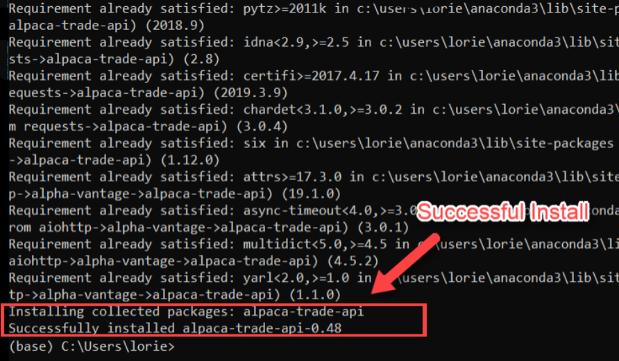

---

## Verify

* The `alpaca-trade-api` package will not run properly unless all needed dependencies and packages are properly installed.

* The above steps should have installed the following packages:

    * pandas

    * requests

    * python-dotenv

    * alpaca-trade-api

* Verify the installation of each package by running the command `conda list package_name` in your terminal, substituting `package_name` for the actual package name from the list above.

* If the package is properly installed, the output from `conda list` will look similar to the following:

  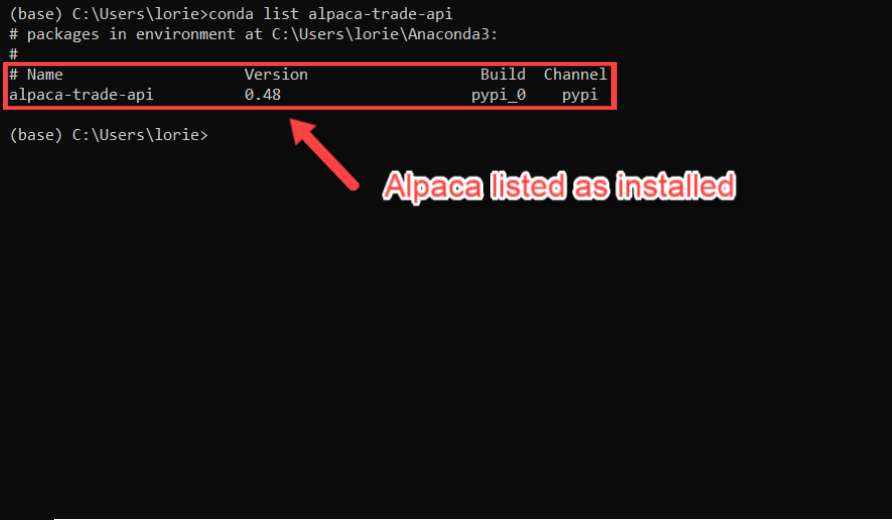

* If you find a package has not been installed, you can do so by running the following command in your terminal, substituting `package_name` for the actual missing package name:

  ```python
  pip install package_name
  ```
---

## Set Environment Variables

As you will learn during class, many APIs will not allow access to their resources without the use of an `api key`. For security these keys will be stored as environment variables in a type of file called `.env`.  The following steps will guide you through the process of creating a `.env`, accessing your api keys, and storing them as environment variables inside your `.env` file.

### Enabling Hidden Files

To work with `.env` files on your machine you will need to be able to view hidden files on your machine.

  * Windows

    * Type `folder` in search bar.
    * Select `File Explorer Options`.
    * Click the `View` tab in the pop up box, then click `Show hidden files, folders and drives` as shown below:

    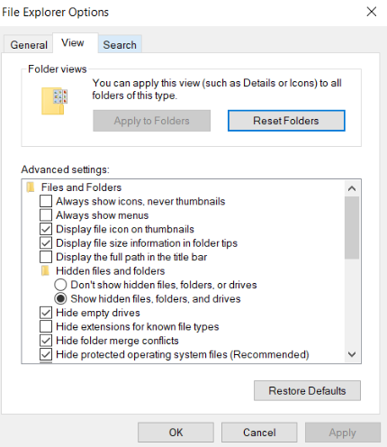

  * Mac OSX

    * Open Finder

    * Press Command + Shift + Dot

  * Linux (Ubuntu)

    * Open your file manager

    * Press Ctrl + H

### Set `ALPACA_API_KEY` and `ALPACA_SECRET_KEY` environment variables

* Go to [Alpaca Markets](https://app.alpaca.markets) and log into your account. After logging in you may be taken to a form asking you for personal information - **YOU DO NOT NEED TO ENTER THIS INFORMATION**.

    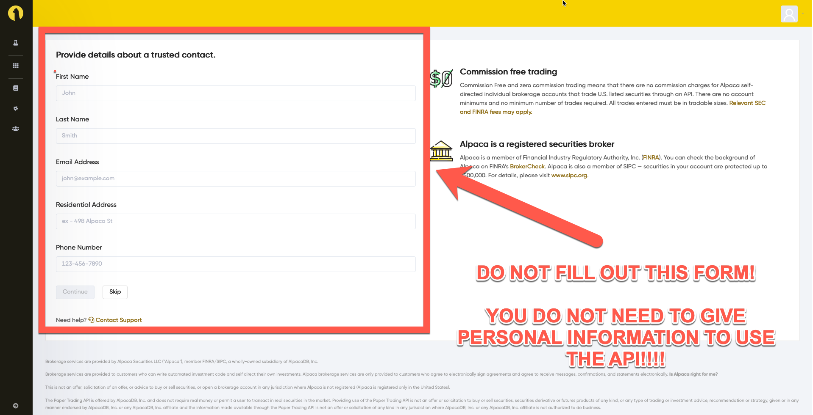

* Now, click the `Go to Paper Account` link in the navigation sidebar.

     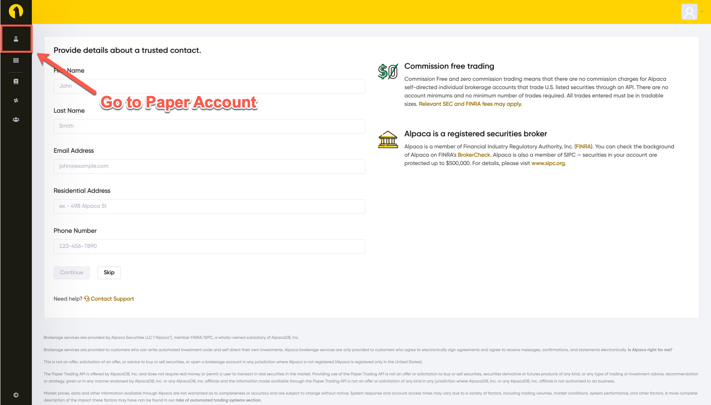

* Now click on the `Your API Keys` section and grab your `ALPACA_API_KEY` and `ALPACA_SECRET_KEY`.

  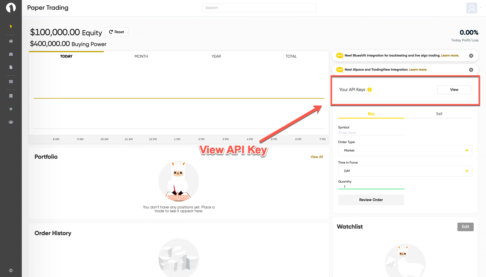

* Next, create a new file named `.env`.  This is where you will store your keys.

* Using the syntax in the image below, create your environment variables inside the `.env` file. **NOTE:** Make sure your environment variables are specifically named `ALPACA_API_KEY` and `ALPACA_SECRET_KEY`.

  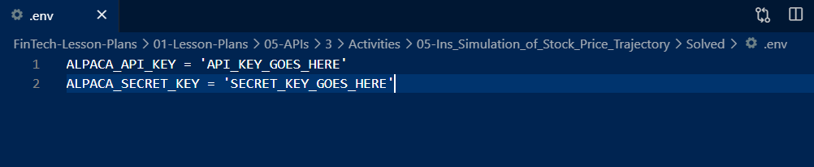

* Save this file in the same folder as your python script or jupyter notebook file.

  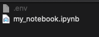

### Set `NASDAQ_API_KEY` environment variable

* Go to [data.nasdaq.com](https://data.nasdaq.com) and log into your account.  After logging in, click on the profile link in the upper right hand corner and select `account settings` from the resulting drop down menu.

  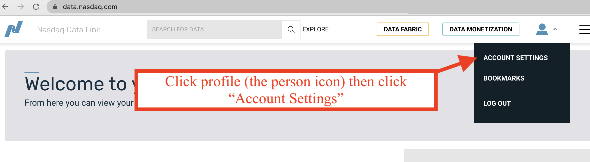

* On the resulting page, click the api key to copy it to your clipboard.

  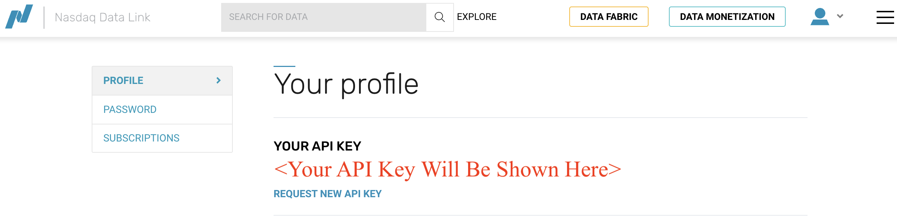

* Next, add this to your existing `.env` file.

* **Note**: Make sure your environment variable is specifically named `NASDAQ_API_KEY`.

  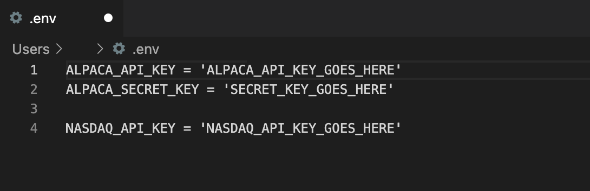
<br>
<br>
---

## Troubleshooting

It can be frustrating when packages do not install correctly, therefore use the below approaches to troubleshoot any installation or usage issues.

### Jupyter Lab

If you have already begun an instance of `jupyter lab` in your terminal prior to creating your environment variables, you may need to restart the kernel so it can scan the environment for new variables.

### Update Conda Environment

An out-of-date Anaconda environment can create issues when trying to install new packages. Follow the steps below to update your conda environment.

1. Deactivate your current conda environment. This is required in order to update the global conda environment. Be sure to quit any running applications, such as Jupyter, prior to deactivating the environment.

    ```shell
    conda deactivate
    ```

2. Update conda.

    ```shell
    conda update conda
    ```

3. Create a fresh conda environment to use with alpaca.

    ```shell
    conda create -n alpacaenv python=3.7 anaconda
    ```

4. Activate the new environment.

    ```shell
    conda activate alpacaenv
    ```

5. Install the libraries following the steps explained above.

---

© 2022 edX Boot Camps LLC. Confidential and Proprietary. All Rights Reserved.
