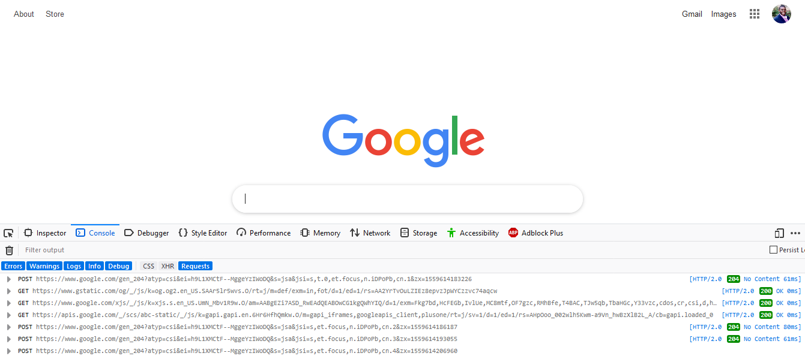
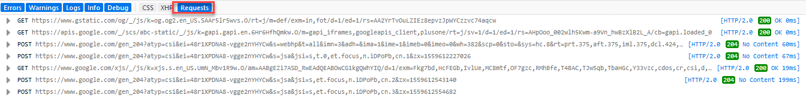
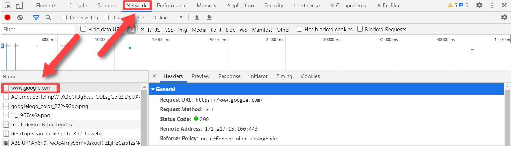
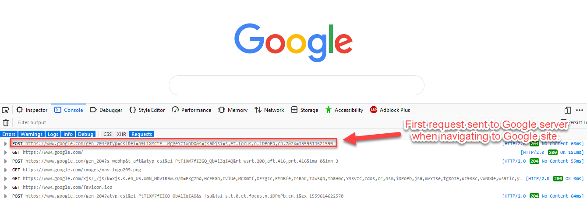
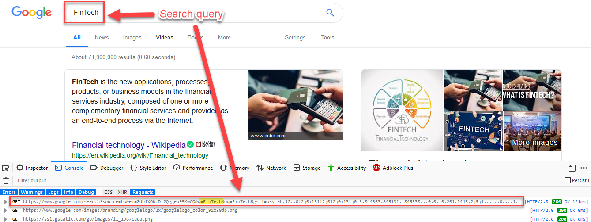
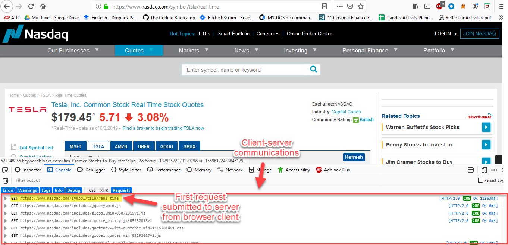

## Eavesdropping on the Server

Eavesdrop on the exchanges sent between client and server when visiting different websites.

1. Open an internet browser, and launch the developer console. Consult the [documentation](https://support.airtable.com/hc/en-us/articles/232313848-How-to-open-the-developer-console) for help with getting the developer console open. Instruction is provided for each browser.

    

2. Make the appropriate selection in your browser:

    * Select `requests` if using Firefox: 

    * Select `network` if using another browser: 

3. Navigate to `https://google.com`.

4. Review the output in the developer console. Compare the `POST` requests with the `GET` requests.

5. Scroll to the top of the console and identify the first request sent to the server. This was the first message sent by the client to the server when the site was accessed. Note:  Depending on the browser being used, your console output may have a different appearance than that seen in the image below.

    

6. Return to Google with the console open and search Google with the phrase `FinTech`.

7. Review the output in the developer console.

    

8. Visit `https://nasdaq.com` and search for a ticker. Review the developer console as you submit the request.

    

9. Continue to navigate the internet with the developer console open. Take note of the type of requests that are sent for each site visited (how many POST vs GET). Also take into consideration the differences in API URLs.
