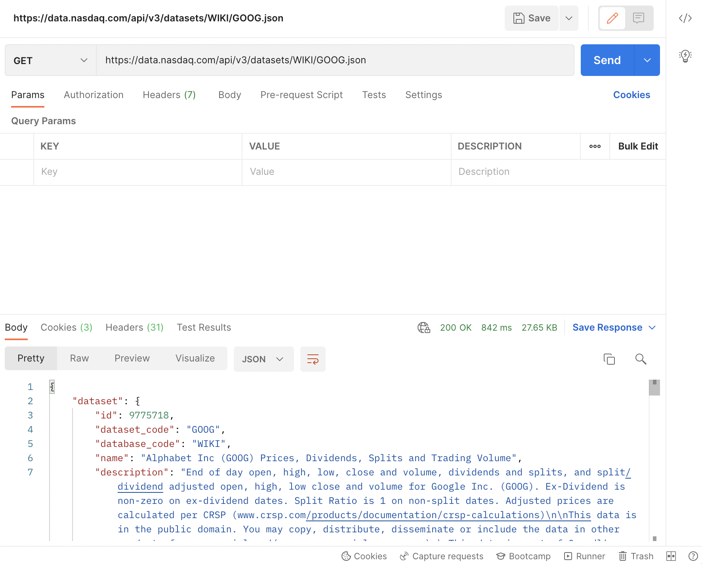
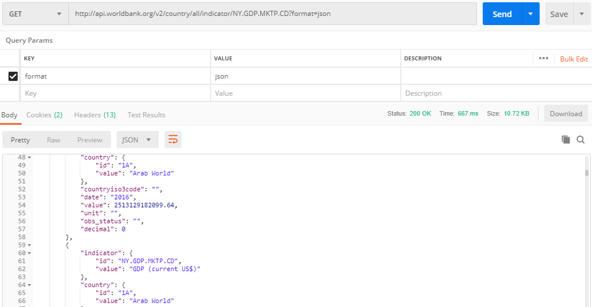
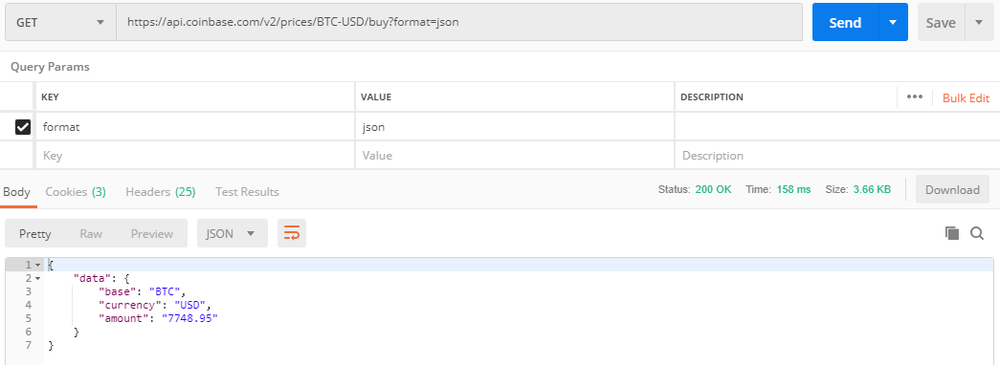
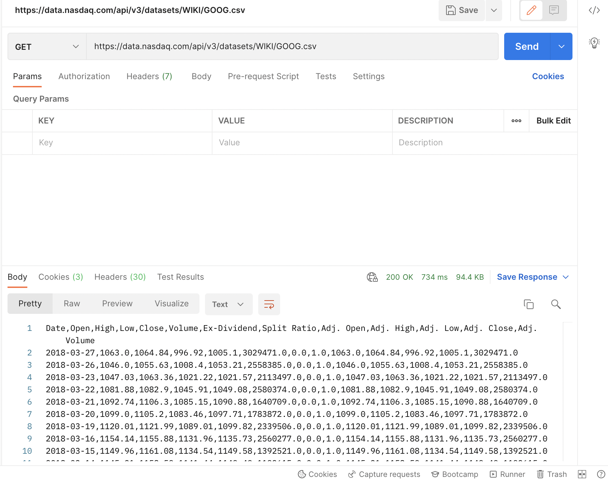

# I Spy an API

1. Get `GOOG` stock data using the `Nasdaq Data Link API`.

    ```
    GET https://data.nasdaq.com/api/v3/datasets/WIKI/GOOG.json
    ```

    

2. Extract `GDP` data for `CA` using `World Bank API`.

    ```
    http://api.worldbank.org/v2/country/ca/indicator/NY.GDP.MKTP.CD?format=json
    ```

    

3. Identify the current `Bitcoin` price using `Coinbase API`.

    ```
    https://api.coinbase.com/v2/prices/BTC-CAD/buy?format=json
    ```

    

4. Get `GOOG` stock data in `CSV` format using the `Nasda Data Link API`. Take note of how the change in URL alters the format (json vs csv) of the data returned by the API.

    ```
    https://data.nasdaq.com/api/v3/datasets/WIKI/GOOG.csv
    ```

    
