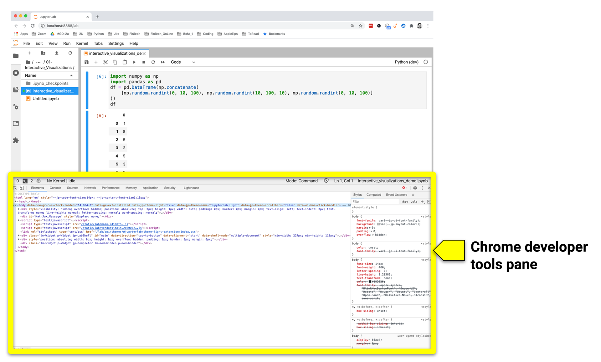

# Troubleshooting Guide for Blank Plots

Rendering visualizations with PyViz can occasionally be troublesome. If your plot doesn’t render in your JupyterLab preview, try the processes in each of the following sections to help you resolve the issue.

## Clear the Cache that’s Associated with the Notebook Kernel

In your Jupyter notebook, on the Kernel menu, click “Restart Kernel and Clear All Outputs,” as the following image shows:


This clears all the existing cell outputs and automatically reruns the notebook from the first cell down.

## Clear the Cache from the Chrome Browser

If you’re using Google Chrome to host JupyterLab, complete the following steps:

1. In the Chrome browser window, press Option+Command+I (for macOS users) or Ctrl+Shift+I (for Windows users). The developer tools pane opens, as the following image shows:



2. With the Chrome developer tools pane open on the JupyterLab page, click and hold the browser reload button. This forces a dropdown menu to appear. On this menu, click “Empty Cache and Hard Reload,” as the following image shows:


If clearing both the kernel and the Chrome browser cache doesn’t work, proceed to the instructions in the next section.

## Recreate Your Conda Environment

If your plots still don’t properly render after clearing both your kernel and Chrome browser caches, the next step is to recreate your Conda `dev` environment. To do so, complete the following steps:

1. Quit any running applications, such as JupyterLab. Then deactivate your current Conda `dev` environment by running the following command:

    ```shell
    conda deactivate
    ```

2. Update the Conda `dev` environment by running the following command:

    ```shell
    conda update conda
    ```

3. Create a new Conda `dev` environment to use with PyViz by running the following command:

    ```shell
    conda create -n dev python=3.7 anaconda
    ```

4. Activate the new environment with the following command:

    ```shell
    conda activate dev
    ```

5. Install PyViz again by following the steps in the “Install the PyViz Ecosystem” section that appears earlier in this lesson.

If your plots still don’t render, reach out to your instructional team for assistance.

---
© 2022 edX Boot Camps LLC. Confidential and Proprietary. All Rights Reserved.
