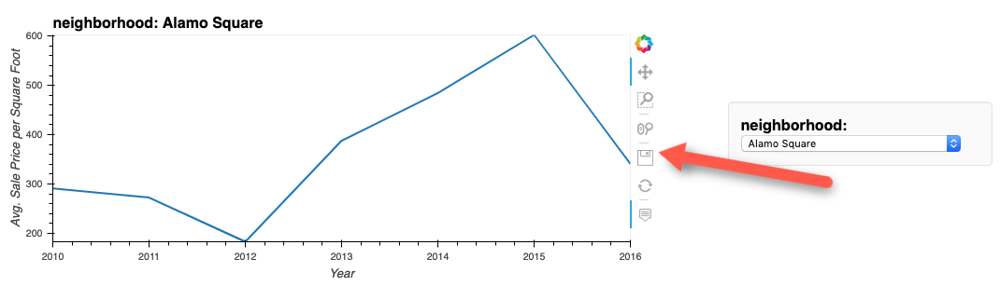

## Unit 6: PyViz

### Helpful Links

* The Form of Facts and Figures: Design Patterns for Interactive Information Visualization by Christian Behrens - <https://christianbehrens.com/portfolio/project/foff>

* hvPlot User Guide: <https://hvplot.pyviz.org/user_guide/index.html>

* PyViz Panel Reference Gallery: <http://panel.pyviz.org/reference/index.html>

* [Geographic data in hvPlot](https://hvplot.holoviz.org/user_guide/Geographic_Data.html)

* [GeoViews](https://geoviews.org/)

---

### FAQs

<details><summary>How do you save a visualization?</summary>

Each module of Pyviz has its own method for saving the visualization:

* Visualizations that utilize Panda's `plot` functionality (Matplotlib backend) can be saved with the `plt.savefig()` function and supplying a file name as a parameter. For more information on this function, check out the [documentation](https://matplotlib.org/3.3.3/api/_as_gen/matplotlib.pyplot.savefig.html).

* Hvplot visualizations can be saved by clicking the disk icon next to the visualization:



</details>

<details><summary>How do you save an interactive visualization as HTML?</summary>

The following code will produce an HTML page of the interactive visualization saved with all of its functionality:

* Interactive hvPlot visualizations can be saved by storing the plot in a variable, running the `hvplot.save` function, and supplying the plot and a file name as parameters. An example can be seen below:

    ```python
    plot = sale_prices_by_year.hvplot.bar(x='saleDate', y='saleAmt')
    hvplot.save(plot, 'test.html')
    ```

</details>

<details><summary>How do I customize elements of the visualization such as size?</summary>

Each module of Pyviz has its own method for adjusting the size of the visualization:

* Changing the size of visualizations that utilize Panda's `plot` function (Matplotlib backend) can be done by adding the `figsize` parameter. This parameter accepts a tuple value for the size. The first value in the tuple is the width, the second is the height. For more information on this parameter, check out the `plot` function's [documentation](https://pandas.pydata.org/pandas-docs/stable/reference/api/pandas.DataFrame.plot.html).

* Changing the size of hvPlot visualizations can be done by adding the `width` and/or `height` parameters. These parameters accept an integer value representive of the number of pixels to use for the width and/or height. For more information on this parameter, check out the hvPlot *Customization* [documentation](https://hvplot.holoviz.org/user_guide/Customization.html).

* Just as size can be customized, there are a multitude of other customization options that be incorporated by using the customization parameters included with the module. Again, those parameters can be found in the documentation:

  * [Pandas `plot` function (Matplotlib backend):](https://pandas.pydata.org/pandas-docs/stable/reference/api/pandas.DataFrame.plot.html).

  * [hvPlot *Customization* documentation](https://hvplot.holoviz.org/user_guide/Customization.html).

</details>

<details><summary>Why can't we simply do a pip install pyviz and get all of these libraries at once?</summary>

Pyviz is a group of multiple open source Python visualization libraries and tools. It would be great if they could all be installed with just a simple pip install, however the Pyviz modules are actually separate modules that are used together. These modules require multiple different dependencies - in some cases different versions of the same dependency. Additionally, being able to properly display the resulting visualizations in Jupyter Lab requires even further installations. Because of all of this, it is tricky to pack it all into one over-arcing install command.

To get Pyviz properly installed on your machine, check out the [Pyviz Installation Guide](PyVizInstallationGuide.md).

</details>

---

© 2022 Trilogy Education Services, a 2U, Inc. brand. All Rights Reserved.
