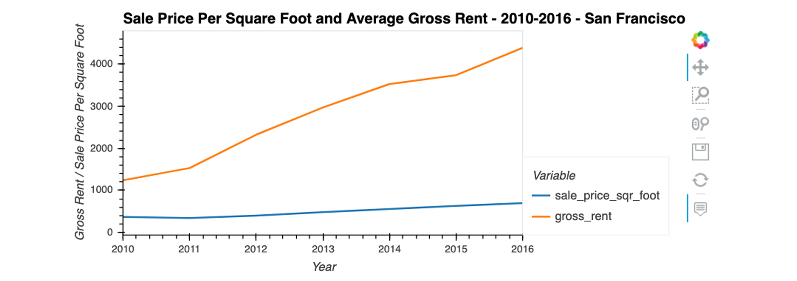

# Unit 6: Housing Rental Analysis for San Francisco

## Background

**Proptech**, the application of technology to real-estate markets, is an innovative domain in the fintech industry. Assume that you’re an analyst at a proptech company that wants to offer an instant, one-click service for people to buy properties and then rent them. The company wants to have a trial of this offering in the San Francisco real estate market. If the service proves popular, they can then expand to other markets.

Your job is to use your data visualization skills, including aggregation, interactive visualizations, and geospatial analysis, to find properties in the San Francisco market that are viable investment opportunities.

For this homework assignment, you’ll need to create and submit the following deliverable:

* A Jupyter notebook that contains your analysis of the housing rental market data for San Francisco. The analysis will be complete with professionally styled and formatted interactive visualizations.

Remember to upload your Jupyter notebook for this assignment to your GitHub repository. Make sure to update the `README.md` file to explain your project and any information that’s needed to interact with your plots.

---

### Files

* [Houing Rental Analysis Starter Code](Starter_Code/san_francisco_housing.ipynb)

* [`housing_per_year` CSV File](Starter_Code/Resources/housing_per_year.csv)

* [`neighbourhoods_coordinates` CSV File](Starter_Code/Resources/neighbourhoods_coordinates.csv)

* [`sfo_neighbourhoods_census_data` CSV File](Starter_Code/Resources/sfo_neighbourhoods_census_data.csv)

---

### Instructions

Use the `san_francisco_housing.ipynb` notebook to visualize and analyze the real-estate data.

Note that this assignment requires you to create a visualization by using hvPlot and GeoViews. Additionally, you need to read the `sfo_neighborhoods_census_data.csv` file from the `Resources` folder into the notebook and create the DataFrame that you’ll use in the analysis.

The main task in this Challenge is to visualize and analyze the real-estate data in your Jupyter notebook. Use the `san_francisco_housing.ipynb` notebook to complete the following tasks:

* Calculate and plot the housing units per year.

* Calculate and plot the average prices per square foot.

* Compare the average prices by neighbourhood.

* Build an interactive neighbourhood map.

* Compose your data story.

##### Calculate and Plot the Housing Units per Year

For this part of the assignment, use numerical and visual aggregation to calculate the number of housing units per year, and then visualize the results as a bar chart. To do so, complete the following steps:

1. Use the `groupby` function to group the data by year. Aggregate the results by the `mean` of the groups.

2. Use the `hvplot` function to plot the `housing_units_by_year` DataFrame as a bar chart. Make the x-axis represent the `year` and the y-axis represent the `housing_units`.

3. Style and format the line plot to ensure a professionally styled visualization.

4. Note that your resulting plot should appear similar to the following image:

    

5. Answer the following question:

    * What’s the overall trend in housing units over the period that you’re analyzing?

##### Calculate and Plot the Average Sale Prices per Square Foot

For this part of the assignment, use numerical and visual aggregation to calculate the average prices per square foot, and then visualize the results as a bar chart. To do so, complete the following steps:

1. Group the data by year, and then average the results. What’s the lowest gross rent that’s reported for the years that the DataFrame includes?

2. Create a new DataFrame named `prices_square_foot_by_year` by filtering out the “housing_units” column. The new DataFrame should include the averages per year for only the sale price per square foot and the gross rent.

3. Use hvPlot to plot the `prices_square_foot_by_year` DataFrame as a line plot.

    > **Hint** This single plot will include lines for both `sale_price_sqr_foot` and `gross_rent`.

4. Style and format the line plot to ensure a professionally styled visualization.

5. Note that your resulting plot should appear similar to the following image:

    

6. Use both the `prices_square_foot_by_year` DataFrame and interactive plots to answer the following questions:

    * Did any year experience a drop in the average sale price per square foot compared to the previous year?

    * If so, did the gross rent increase or decrease during that year?

##### Compare the Average Sale Prices by Neighbourhood

For this part of the assignment, use interactive visualizations and widgets to explore the average sale price per square foot by neighbourhood. To do so, complete the following steps:

1. Create a new DataFrame that groups the original DataFrame by year and neighbourhood. Aggregate the results by the `mean` of the groups.

2. Filter out the “housing_units” column to create a DataFrame that includes only the `sale_price_sqr_foot` and `gross_rent` averages per year.

3. Create an interactive line plot with hvPlot that visualizes both `sale_price_sqr_foot` and `gross_rent`. Set the x-axis parameter to the year (`x="year"`). Use the `groupby` parameter to create an interactive widget for `neighbourhood`.

4. Style and format the line plot to ensure a professionally styled visualization.

5. Note that your resulting plot should appear similar to the following image:

    

6. Use the interactive visualization to answer the following question:

    * For the Anza Vista neighbourhood, is the average sale price per square foot for 2016 more or less than the price that’s listed for 2012?

##### Build an Interactive Neighborhood Map

For this part of the assignment, explore the geospatial relationships in the data by using interactive visualizations with hvPlot and GeoViews. To build your map, use the `sfo_data_df` DataFrame (created during the initial import), which includes the neighbourhood location data with the average prices. To do all this, complete the following steps:

1. Read the `neighbourhood_coordinates.csv` file from the `Resources` folder into the notebook, and create a DataFrame named `neighborhood_locations_df`. Be sure to set the `index_col` of the DataFrame as “Neighbourhood”.

2. Using the original `sfo_data_df` Dataframe, create a DataFrame named `all_neighbourhood_info_df` that groups the data by neighbourhood. Aggregate the results by the `mean` of the group.

3. Review the two code cells that concatenate the `neighbourhood_locations_df` DataFrame with the `all_neighbourhood_info_df` DataFrame. Note that the first cell uses the [Pandas concat function](https://pandas.pydata.org/pandas-docs/stable/reference/api/pandas.concat.html) to create a DataFrame named `all_neighbourhoods_df`. The second cell cleans the data and sets the “Neighborhood” column. Be sure to run these cells to create the `all_neighbourhoods_df` DataFrame, which you’ll need to create the geospatial visualization.

4. Using hvPlot with GeoViews enabled, create a `points` plot for the `all_neighbourhoods_df` DataFrame. Be sure to do the following:

    * Set the `size` parameter to “sale_price_sqr_foot”.

    * Set the `color` parameter to “gross_rent”.

    * Set the `frame_width` parameter to 700.

    * Set the `frame_height` parameter to 500.

    * Include a descriptive title.

    Note that your resulting plot should appear similar to the following image:

    

5. Use the interactive map to answer the following question:

    * Which neighbourhood has the highest gross rent, and which has the highest sale price per square foot?

##### Compose Your Data Story

Based on the visualizations that you created, answer the following questions:

* How does the trend in rental income growth compare to the trend in sales prices? Does this same trend hold true for all the neighbourhoods across San Francisco?

* What insights can you share with your company about the potential one-click, buy-and-rent strategy that they're pursuing? Do neighbourhoods exist that you would suggest for investment, and why?

### Requirements

#### Calculate and Plot the Housing Units per Year (10 points)

##### To receive all points, you must

* Use the `groupby` function to group the data by year. Aggregate the results by the mean of the groups. (2 points)

* Use the `hvplot` function to plot the `housing_units_by_year` DataFrame as a bar chart. Make the x-axis represent the year and the y-axis represent the housing_units. (2 points)

* Style and format the line plot to ensure a professionally styled visualization. (2 points)

* Answer the following question:

  * What’s the overall trend in housing units over the period that you’re analyzing? (4 points)

#### Calculate and Plot the Average Sale Prices per Square Foot (10 points)

##### To receive all points, you must

* Group the data by year, and then average the results. What’s the lowest gross rent that’s reported for the years that the DataFrame includes? (2 points)

* Create a new DataFrame named `prices_square_foot_by_year` by filtering out the “housing_units” column. The new DataFrame should include the averages per year for only the sale price per square foot and the gross rent. (2 points)

* Use hvPlot to plot the `prices_square_foot_by_year` DataFrame as a line plot. (2 points)

* Style and format the line plot to ensure a professionally styled visualization. (2 points)

* Use both the `prices_square_foot_by_year` DataFrame and interactive plots to answer the following questions:

  * Did any year experience a drop in the average sale price per square foot compared to the previous year? (1 point)

  * Did the gross rent increase or decrease during that year?  (1 point)

#### Compare the Average Sale Prices by Neighbourhood (20 points)

##### To receive all points, you must

* Create a new DataFrame that groups the original DataFrame by year and neighbourhood. Aggregate the results by the mean of the groups. (4 points)

* Filter out the “housing_units” column to create a DataFrame that includes only the `sale_price_sqr_foot` and `gross_rent averages` per year. (4 points)

* Create an interactive line plot with hvPlot that visualizes both `sale_price_sqr_foot` and `gross_rent`. Set the x-axis parameter to the year (x="year"). Use the `groupby` parameter to create an interactive widget for `neighbourhood`. (4 points)

* Style and format the line plot to ensure a professionally styled visualization. (4 points)

* Use the interactive visualization to answer the following question:

  * For the Anza Vista neighbourhood, is the average sale price per square foot for 2016 more or less than the price that’s listed for 2012? (4 points)

#### Build an Interactive Neighbourhood Map (20 points)

##### To receive all points, you must

* Read the `neighbourhood_coordinates.csv` file from the `Resources` folder into the notebook, and create a DataFrame named `neighbourhood_locations_df`. Be sure to set the `index_col` of the DataFrame as “Neighbourhood”. (3 points)

* Using the original `sfo_data_df` Dataframe, create a DataFrame named `all_neighbourhood_info_df` that groups the data by neighbourhood. Aggregate the results by the mean of the group. (3 points)

* Review the two code cells that concatenate the `neighborhood_locations_df` DataFrame with the `all_neighbourhood_info_df` DataFrame. Note that the first cell uses the Pandas `concat` function to create a DataFrame named `all_neighbourhoods_df`. The second cell cleans the data and sets the “Neighbourhood” column. Be sure to run these cells to create the `all_neighbourhoods_df` DataFrame, which you’ll need to create the geospatial visualization. (3 points)

* Create a `points` plot for the `all_neighbourhoods_df` DataFrame.

  * Use the hvPlot `points` function. (1 point)

  * Set the `geo` parameter to True. (1 point)

  * Set the `size` parameter to “sale_price_sqr_foot”. (1 point)

  * Set the `color` parameter to “gross_rent”. (1 point)

  * Set the `frame_width` parameter to 700. (1 point)

  * Set the `frame_height` parameter to 500. (1 point)

  * Include a descriptive title. (2 points)

* Use the interactive map to answer the following question:

  * Which neighbourhood has the highest gross rent, and which has the highest sale price per square foot? (3 points)

#### Compose Your Data Story (10 points)

##### To receive all points, you must

* Based on the visualizations that you created, answer the following questions:

  * How does the trend in rental income growth compare to the trend in sales prices? Does this same trend hold true for all the neighbourhoods across San Francisco? (5 points)

  * What insights can you share with your company about the potential one-click, buy-and-rent strategy that they're pursuing? Do neighbourhoods exist that you would suggest for investment, and why? (5 points)

#### Coding Conventions and Formatting (10 points)

##### To receive all points, your code must

* Place imports at the top of the file, just after any module comments and docstrings, and before module globals and constants. (3 points)

* Name functions and variables with lowercase characters, with words separated by underscores. (2 points)

* Follow DRY (Don't Repeat Yourself) principles, creating maintainable and reusable code. (3 points)

* Use concise logic and creative engineering where possible. (2 points)

#### Deployment and Submission (10 points)

##### To receive all points, you must

* Submit a link to a GitHub repository that’s cloned to your local machine and contains your files. (4 points)

* Use the command line to add your files the repository. (3 points)

* Include appropriate commit messages in your files. (3 points)

#### Comments (10 points)

##### To receive all points, your code must

* Be well commented with concise, relevant notes that other developers can understand. (10 points)

---

© 2022 edX Boot Camps LLC. Confidential and Proprietary. All Rights Reserved.
