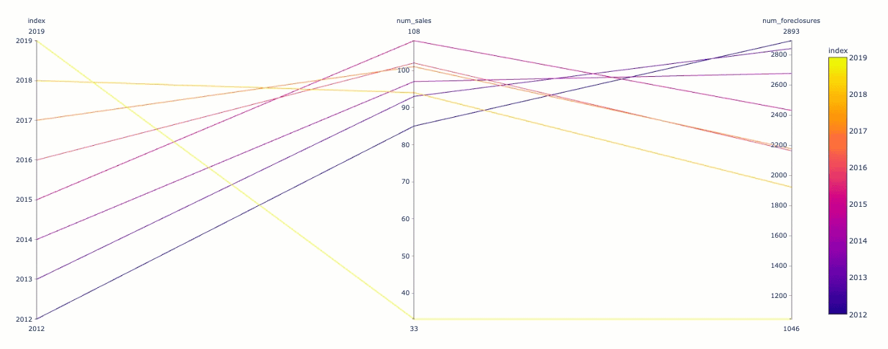

# Plotting in Parallel

It's been about a week since your last interview with REMAX, and you're still waiting to hear back regarding an offer. In anticipation of the REMAX call, you've been doing a lot of research about data visualization and the different types of statistical plots.

During your research, you came across a plot you've only seen offered with **Plotly Express**: the **parallel coordinate** plot. Your research shows that parallel coordinate plots are great for performing an impact analysis, which is key when assessing trends in the real estate market.

Use the Allegheny County sales and foreclosures data sets to get some practice using parallel coordinate plots. Then, analyze the key performance indicators for real estate in parallel.

## Instructions

1. Open the [starter file](Unsolved/plotting_in_parallel.ipynb):
 
   * Read in the data.

    * Using `groupby`, slide the data to get a count of the instances of both sales and foreclosures by year.

    * Rename the columns for both `sales_grp_cnt` and `foreclosures_grp_cnt`.

2. Concatenate the `sales_grp_cnt` and `foreclosures_grp_cnt` DataFrames. Concatenate on `axis=1`. Hint: drop nulls and reset the index after concatenating. Name this object `sales_foreclosures_cnt`.

3. Plot `sales_foreclosures_cnt`. Using the `color` argument, set the colour to be based on the Series `index`.

4. Sort the axes so that `index` axes are in the middle of `num_sales` and `num_foreclosures`.

5. Explore the data and understand the relationship between the number of sales, number of foreclosures, and the year.

### Challenge

If time remains, complete the challenge activity below.

1. Using the original `sales` and `foreclosures` DataFrames, calculate the sum total of all sales and foreclosures by year. This should result in two new DataFrames:
        
    * One containing the total dollar amount of housing sales. 
    * One containing the total dollar amount of foreclosures.

2. Rename the columns for both DataFrames to `amount_from_sales` and `amount_from_foreclosures`.

3. Concatenate the new DataFrames on `axis=1`. 

4. Plot the data using the Plotly Express `parallel_coordinates` plot.

    

### Hint

Use the `reset_index` function whenever an index field needs to be manipulated or displayed on a plot.

Dropping nulls after concatenation will ensure that data relationships are preserved. This will ensure partial data is not being reported on.

---

© 2020 Trilogy Education Services, a 2U, Inc. brand. All Rights Reserved.
