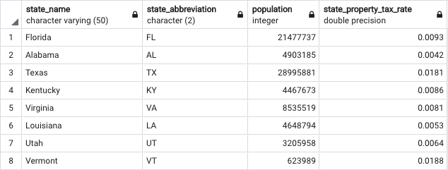
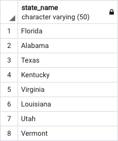

# Creating Tables

In this activity, you will use pgAdmin to recreate and query a table based on an image provided to you.

## Instructions

1. Create a new database in pgAdmin named `state_info`.

2. Using the query tool, create an empty table named `states`. Be sure to match the data types!

    **Note:** When defining the `state_property_tax_rate` column, use the `FLOAT` data type.

3. Insert data into the new table. The result should match the following image.

    

4. Query the table to recreate the following image.

    

## Bonus

1. Filter the table to view only state abbreviations.

2. Filter the table to view states with a population greater than `5,000,000`.

3. Filter the table to view states with a population of greater than `5,000,000` and a state property tax rate of less than `0.01`.

## Hints

* For the second bonus question, you will need to use a [`WHERE` clause](https://www.tutorialspoint.com/sql/sql-where-clause.htm) to filter the original query.

* For the third bonus question, an [`AND` clause](https://www.tutorialspoint.com/sql/sql-and-or-clauses.htm) will also be necessary.

---

© 2022 edX Boot Camps LLC. Confidential and Proprietary. All Rights Reserved.
