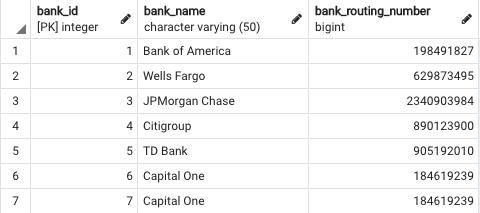

# Making and Using an ID

In this activity, you will recreate a table and then query, insert, and update data.

## Instructions

1. Create a new database named `bank_db`.

2. Recreate the `banks` table using the following image.

    

3. Query the table to return the rows containing "Capital One", and then delete one of the duplicates.

4. Insert a few more rows of data representing additional banks by adding the `bank_name` and `bank_routing_number` of your choice to the `banks` table.

5. Change the name of Citigroup to PNC Bank.

6. Change the bank_routing_number for Wells Fargo to 1995826182.

## Bonus

* Research how to add columns to a table. Then create a Boolean column named `mortgage_lending` that has a default value of `true`.

* Start looking into the concept of joins in SQL. (This concept will be covered later in the lesson.)

---

© 2022 edX Boot Camps LLC. Confidential and Proprietary. All Rights Reserved.
