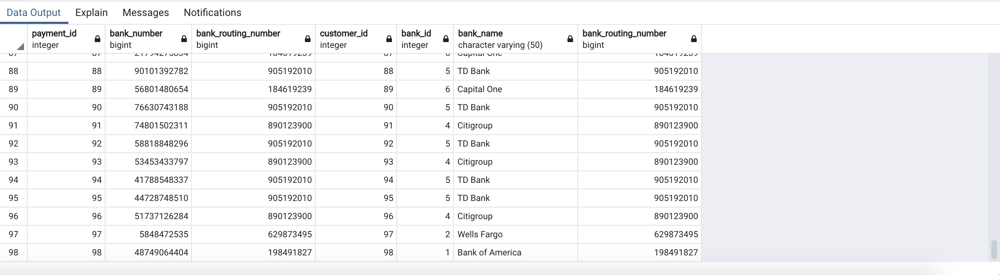
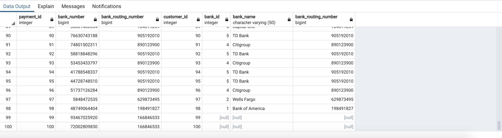
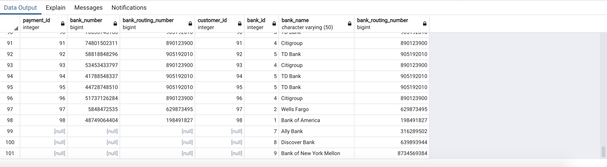
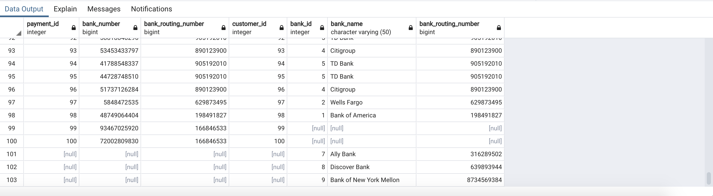
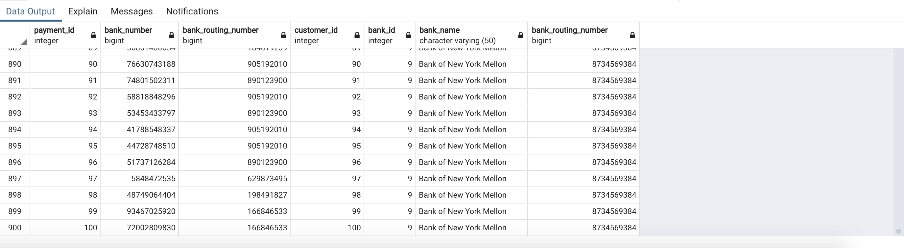
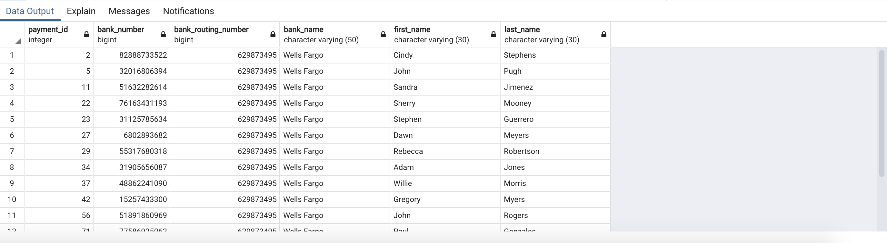

# Joining the Big Banks

In this activity, you will be using joins to query payment information and associated bank information via a common bank routing number.

## Instructions

1. Create a new database named `payments_db`.

2. Create two tables named `payments` and `banks`, then import the data from `payments.csv` and `banks.csv` using the pgAdmin Import/Export tool:

    * [payments.csv](Resources/payments.csv)

    * [banks.csv](Resources/banks.csv)

    **Note:** Remember to refresh the database; newly created tables will not immediately appear.

3. Perform the correct join for each of the following use cases using the common `bank_routing_number` from the `payments` and `banks` tables:

    **Note:** Assume the `payments` table is the designated "left" table and the `banks` table is the designated "right" table.

    * Return all payment records with matching bank routing numbers in the banks table.

      

    * Return all payment records regardless if there is a matching bank routing number in the banks table.

      

    * Return all bank records regardless if there is a matching bank routing number in the payments table.

      

    * Return all records from both tables regardless if there is a matching bank routing number in either table.

      

    * Return paired records from both tables where each row of the first table is paired with each row of the second table.

      

## Bonus

Create a `customer` table and import the [customer.csv](Resources/customer.csv) dataset. Then, join the customer table with the payments and banks tables to find the customers who have Wells Fargo bank accounts. Return the following columns:

* `payment_id`
* `bank_number`
* `bank_routing_number`
* `bank_name`
* `first_name`
* `last_name`

---

© 2022 edX Boot Camps LLC. Confidential and Proprietary. All Rights Reserved.
