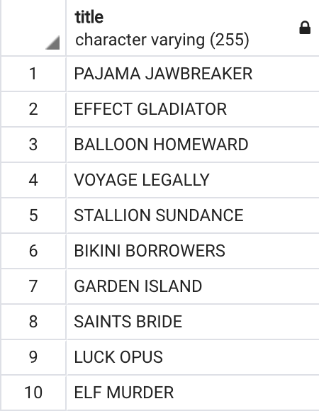
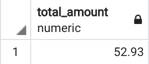

# Mine the Subqueries

In this activity, you will continue to practice subqueries. Work individually or in pairs. You can use the [ERD](http://www.postgresqltutorial.com/postgresql-sample-database/) for help with the queries.

## Instructions

* Using subqueries, find the titles of films that the employee `Jon Stephens` rented to customers.

  * The results should be similar to the following:

  

* Using subqueries, find the total rental amount paid for the film `ACE GOLDFINGER`

  * The results should be similar to the following:

  

---

© 2022 edX Boot Camps LLC. Confidential and Proprietary. All Rights Reserved., a 2U, Inc. brand. All Rights Reserved.
