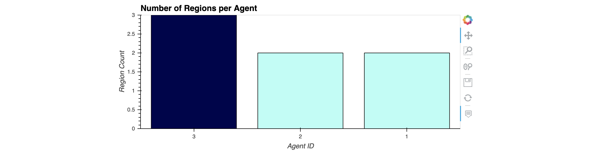

# Feeding Pandas with SQL

In this activity you will read data into a Pandas DataFrame from the `agent_db` database you created before.

## Instructions

As database consultant, you are asked to create a report to identify how many agents are assigned to the various regions in the United States, so you decided to combine your Python and SQL skills.

Using the `agent_db` database that you created before, perform the following tasks:

* Create a connection to the `agent_db` database on your local PostgreSQL instance.

* Create a Pandas DataFrame by reading all the records from the `agents` table.

* Create a Pandas DataFrame by by querying the `agents` table for region Count per agent ID.

* Create a bar chart using `hvplot` that shows the number of regions per `agent_id`.

Your bar chart should look like this.

## Bonus

* Create a Pandas DataFrame and associated bar chart for the number of regions per full agent name. You will have to use the `CONCAT` function to achieve this.

* Create a Pandas DataFrame and associated bar chart for the number of agents per region name.

---

© 2022 edX Boot Camps LLC. Confidential and Proprietary. All Rights Reserved.
