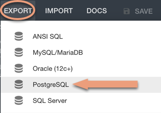

# Designing an ERD, Part 2

In this activity, you and your partner will continue designing a database model for the mortgage lending database by transitioning your logical ERD created in the previous activity to a physical ERD.

## Instructions

* Using the [starter code](Unsolved/schema.txt) provided, return to [Quick Database Diagrams](https://app.quickdatabasediagrams.com/#/) and transition your logical ERD to a physical ERD by defining the data types of columns and the type of entity relationships between tables.

* When you are satisfied with your ERD, export the diagram as a PostgreSQL file:

  * In the Quick Database Diagrams tool, click on the Export tab and select PostgreSQL from the drop-down menu.

    

  * A file named `QuickDBD-export.sql` will appear in your Downloads folder.

* In pgAdmin, connect to your server and create a new database named `mortgage`. Then open a query tool.

* Open the file you downloaded with VS Code. Paste the code in pgAdmin, and then execute the code.

## Hints

* Foreign keys are added to each table represented by the `FK` acronym, followed by the relationship, e.g., `mortgage_id INT FK - Mortgage.mortgage_id`.

* You will need to add foreign keys to your tables in order to map the data relationships.

* Remember to document the relationships between entities using the correct symbols. Here are the allowed relationship types:

  

* Keep in mind the following:

  * Each bank has only one routing number.

  * Each mortgage has only only one id.

  * Sales will have multiple payments, but each payment will have only one unique id.

  * Each customer must have one unique id, but each customer will make multiple payments.

* Once the exported code has been used to create tables using pgAdmin, you can check the table creation with the following syntax. (Note the quotations around the table name.)

  ```sql
  SELECT * FROM "Customer";
  ```

---

© 2022 edX Boot Camps LLC. Confidential and Proprietary. All Rights Reserved.
