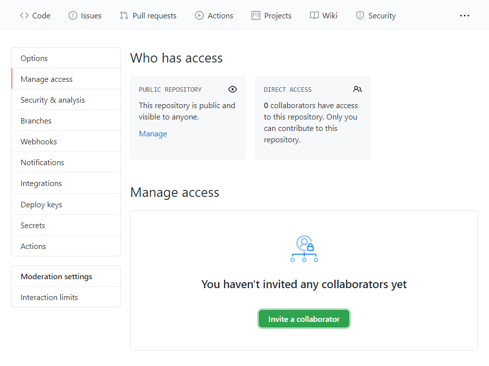

# Create a Repository

In this activity, we will create a Github repository and add group members as collaborators.

## Instructions

* One group member should create a new Github repository. Don't worry about the project name now, this can be changed later.

* From the repo's main page, click the "Settings" tab.

* Once in the repo's settings, select the "Manage access" menu item on the left.

* From the "Manage access" page, invite your group members to be project collaborators by entering their Github usernames one at a time.

* Each invited group member should receive an email they must open to accept the invitation.

### Hints

* Ask an instructor or TA if you get stuck!

- - -

© 2022 edX Boot Camps LLC. Confidential and Proprietary. All Rights Reserved.
