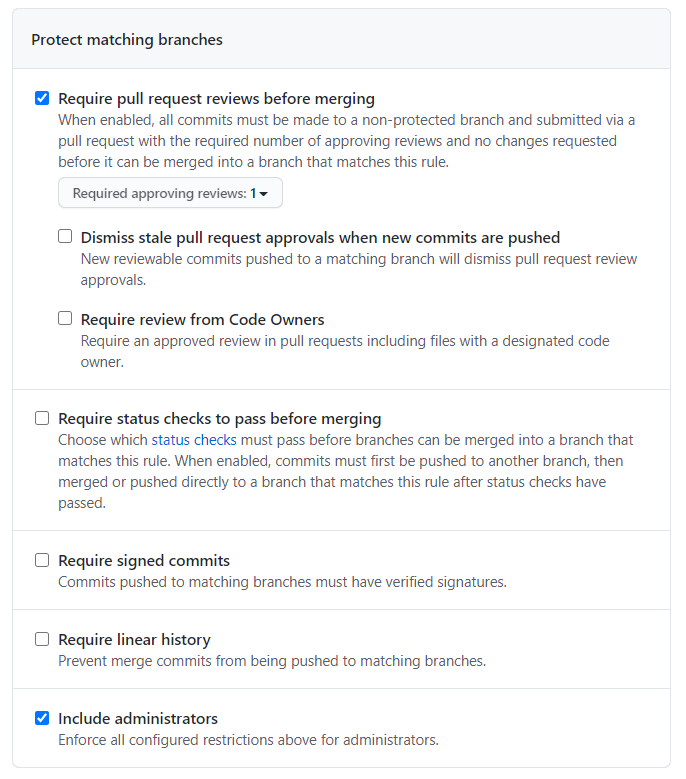

# Student Do: Protect main Branch

In this activity, we will protect our repo's main branch.

## Instructions

* Only the repo creator of each group needs to complete this activity. The remaining group members should observe/assist.

* Navigate back to the repo's "Settings" page and then select "Branches" from the left sidebar.

* From the "Branches" page, click the `Add rule` button in the "Branch protection rules" section.

* You should be presented with some options: 

  * First type a rule nam ein the "Branch name pattern" box.

  * Then, check off the following:

    * "Require pull request reviews before merging"

    * "Include administrators"

  

* Click the green `Create` button to finalize the changes.

* If completed successfully, no one should be able to push directly to the main branch. Instead, all changes must be made in the form of pull requests that are to be reviewed by another group member.

### Hints

* Ask an instructor or TA for assistance if you get stuck!

- - -

© 2022 edX Boot Camps LLC. Confidential and Proprietary. All Rights Reserved.
