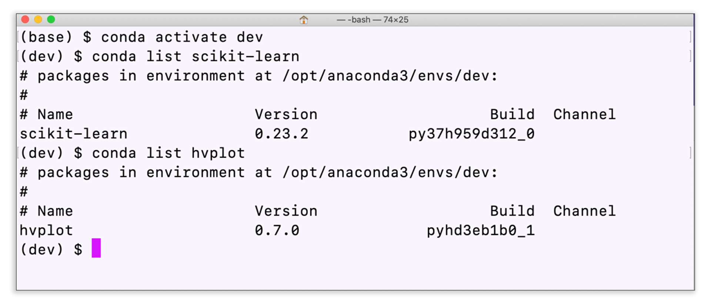

# Install scikit-learn and hvPlot

In this module, you’ll use JupyterLab and the following Python libraries:

- scikit-learn

- hvPlot

The scikit-learn library is automatically installed with Anaconda, and you’ve already worked with hvPlot in previous modules. But it’s good practice to confirm they are installed in your Conda development environment.

## Before You Begin

Before class, confirm that scikit-learn and hvPlot are installed and working correctly in your `dev` environment. To do so, follow the steps in this section. 

### Confirm the scikit-learn and hvPlot Installations

To check that scikit-learn and hvPlot are installed in your Conda `dev` environment, complete the following steps.

1. Activate your Conda `dev` environment (if it isn’t already) by running the following in your terminal:

```shell
conda activate dev
```

2. When the environment is active, run the following in your terminal:

```shell
conda list scikit-learn
conda list hvplot
```

If the scikit-learn and hvPlot libraries are installed on your machine, your terminal will display the following:



If you see scikit-learn and hvPlot listed in the terminal, you’re all set!

### Install scikit-learn

If your terminal does not display scikit-learn and you need to install it, run the following:

```shell
pip install -U scikit-learn
```

When the installation is complete, return to Step 2 in the previous section to verify the installation.

### Install hvPlot

If you need to install the hvPlot library, run the following in your terminal:

```shell
conda install -c pyviz hvplot
```

When the installation is complete, return to Step 2 in the previous section to verify the installation.

You're now all set up!

---

© 2022 edX Boot Camps LLC. Confidential and Proprietary. All Rights Reserved.