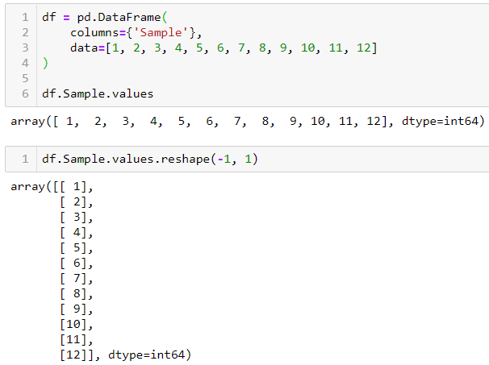

# Module 11: Time Series

This guide provides answers to some commonly asked questions about the material in this module.

## FAQs

<details>
<summary>What's the point of using `datetime` objects?</summary>

Humans look at dates and instantly know how to categorise them: day, month, year, and so on. But to your code, dates are just another line of text that will get interpreted as strings. This can make cleaning, prepping, and plotting data very difficult. This is where time series functionality becomes very useful. Converting your date strings to `datetime` type translates them, allowing your code to interpret and categorise dates the same way you do.

For example, let's plot some [_Jeopardy_ data](https://www.kaggle.com/datasets/prondeau/350000-jeopardy-questions?resource=download) from the last 35 seasons. In the following example, the data is read in via `.read_csv()`, but the dates are read in as `strings` by default. You can see that the dates are not categorised. Instead, they are plotted in the order that they appear in the data:

<br>

```python
df = pd.read_csv('jeopardy.csv', index_col=’air_date’)
type(df.index[0])

df[‘value’].plot(rot=45)
```

In the next example, the dates are parsed and converted to `datetime` objects. The dates are now being categorised properly and are listed in the correct order automatically:

<br>

```python
df = pd.read_csv(
'jeopardy.csv',
infer_datetime_format=True,
parse_dates=True,
index_col=’air_date’
)
type(df.index[0])

df[‘value’].plot(rot=45)
```

</details>
<details><summary>How do you convert objects to `datetime`?</summary>

Converting objects to `datetime` can be tricky.  When using Pandas, you should handle the conversion upon the reading in of data.  The syntax to handle the conversion from `read_csv()` is the following:

```python
df = pd.read_csv('jeopardy.csv', parse_dates=True)
```

This converts each object to a `datetime` object. Alternatively, you can also set the index as the date column, for ease of plotting:

```python
df = pd.read_csv('jeopardy.csv', infer_datetime_format=True, parse_dates=True, index_col='air_date)
```

</details>
<details><summary>How do you access `datetime` objects?</summary>

There are numerous ways to access `datetime` objects. One of the benefits of using these data types is the added functionality they provide for plotting, cleaning, and aggregating data. Using our _Jeopardy_ example to illustrate, we can access different episodes using different date calls:

<blockquote>
<details>
<summary>To access rows by a particular year:</summary>


```python
df.loc[‘1987’]
```

</details>
<details>
<summary>To access rows by a particular year and month:</summary>


```python
df.loc[‘1987-04’]
```

</details>

<details>
<summary>To access rows by a particular year, month, and day:</summary>


```python
df.loc[‘1987-04-06’]
```

</details>
<details>
<summary>To access a range of dates by year:</summary>


```python
df.loc[‘1987’:’1990’]
```

</details>
<details>
<summary>To access a range of dates by year and month:</summary>


```python
df.loc[‘1987-04’:’1990-10’]
```

</details>
<details>
<summary>To access a range of dates by year, month, and day:</summary>


```python
df.loc[‘1987-04-06’:’1990-10-15’]
```

</details>
</blockquote>

</details>

<details><summary>How do you group time series data?</summary>

The `.resample()` method allows grouping by multiple categories. This is similar to the `.groupby()` function, where an aggregation method must be used to show the grouped data.  For example, we can group the mean _Jeopardy_ point values by year using the following code:

<br>

```python
df.[‘value’].resample(‘Y’).mean()
```

The data can then be plotted:

```python
df.[‘value’].resample(‘Y’).plot()
```

<br>

The following is a non-exhaustive list of many `.resample()` frequency aliases:

| Alias        | Frequency Description             |
| ------------ | --------------------------------- |
| `D`          | Calendar day                      |
| `W`          | Weekly                            |
| `M`          | Month end                         |
| `SM`         | Semi-month end (15th & month end) |
| `BM`         | Business month end                |
| `MS`         | Month start                       |
| `SMS`        | Semi-month start (1st and 15th)   |
| `BMS`        | Business month start              |
| `Q`          | Quarter end                       |
| `BQ`         | Business quarter end              |
| `QS`         | Quarter start                     |
| `BQS`        | Business quarter start            |
| `A`          | Year end                          |
| `BA`, `BY`   | Business year end                 |
| `AS`, `YS`   | Year start                        |
| `BAS`, `BYS` | Business year start               |
| `BH`         | Business hour                     |
| `H`          | Hourly                            |
| `T`, `min`   | Minutes                           |
| `S`          | Seconds                           |
| `L`, `ms`    | Milliseconds                      |
| `U`, `us`    | Microseconds                      |
| `N`          | Nanoseconds                       |

</details>

<details><summary>What is .reshape(), and why do you have to use it?</summary>

When working with Pandas, we often pass Series objects into our model. The shape of values in a Pandas Series object is a 1d array. This must be converted into a 2d array which is essentially an array of arrays, or list of lists. We perform this task with the `.reshape()` function. We pass the matrix values that we want into this function. In the following example, we reshape our list into a 2d array using `.reshape(3,4)`, where 3 is the number of lists and 4 is the number of values in each list:


```python
import numpy as np
x = np.array([1, 2, 3, 4, 5, 6, 7, 8, 9, 10, 11, 12])
print(x)
x.reshape(3,4)
```

Many models require the 2d array to be formatted so that each value is in a list by itself. If we were inserting the above sample data into a model, we would convert the data using `.reshape(-1,1)`, where -1 indicates an unknown number of rows, and 1 indicates the number of values in each list. The -1 will allow the function to generate the amount of rows necessary to hold the data. The output looks like this:



```python
df = pd.DataFrame(
       columns - {‘Sample’},
       data=[[1, 2, 3, 4, 5, 6, 7, 8, 9, 10, 11, 12]
)

df. Sample.values
df.Sample.values.reshape(-1,1)
```

</details>

---

© 2022 edX Boot Camps LLC. Confidential and Proprietary. All Rights Reserved.
