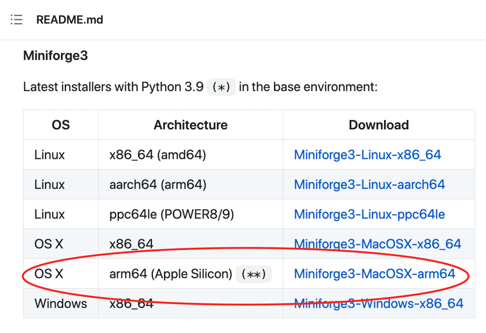

# Deep Learning Setup Guide

This guide serves as a step by step process for setting up and validating the tools required for the deep learning portion of the curriculum.

This guide will include installation and verification steps for TensorFlow 2.0 and Keras.

---

## Installation Instructions

<details>
<summary>Apple Silicon M1 Computers</summary>

Apple M1 and M+ architecture has recently gained Tensorflow support, but there are a few more install steps than for non Apple silicon chips.

A helpful install guide can be found [here](https://www.mrdbourke.com/setup-apple-m1-pro-and-m1-max-for-machine-learning-and-data-science/), which mainly involves additionally installing `tensorflow-deps`, `tensorflow-macos`, and `tensorflow-metal`.

If you run into M chip install difficulties, the simplest way to run the activities for this unit is in [Google Colab](https://colab.research.google.com/) which comes with support for TensorFlow.

</details>

<details>
<summary>All Other Mac & Windows Machines</summary>

The `TensorFlow 2.0` package has several dependencies which should already be installed in the default conda environment. Please refer to the troubleshooting section for details about this environment. Make sure to run the following commands with your conda environment activated.

Open the terminal, and execute the following command to install `TensorFlow`.

* Use the `pip install` command to install the `TensorFlow 2.0` module.

```shell
pip install --upgrade tensorflow
```

### Verify Installation

Once the `TensorFlow` install is complete, verify the installation was completed successfully.

```shell
conda list tensorflow
```

The output of this command should show version `2.5.0` or higher.

---

## Keras

Keras is a popular deep learning framework that serves as a high-level API for TensorFlow. Keras is now included with TensorFlow 2.0, so run the following command to verify that the package is available:

```shell
conda list keras
```

The output should be `2.5.0` or later.

</details>

---

## Troubleshooting

<details><summary>Apple Silicon M1 Computers</summary>

If Google Colab is down, there is a way to install Tensorflow on Apple Silicon M1 machines.  To do so, follow the instructions below:

1. Download [‘Miniforge3-MacOSX-arm64.sh’](https://github.com/conda-forge/miniforge/releases/latest/download/Miniforge3--arm64.sh) from [Miniforge](https://github.com/conda-forge/miniforge#miniforge3). This is the version specifically for the new Apple Silicon architecture.

    

2. Open a terminal and set the default to `bash` by running the command `chsh -s /bin/bash`. Enter your password if prompted. Once the process completes, close the terminal.

3. Next we will install Miniforge. To install it, open a new terminal window and `cd` into your `Downloads` folder, then run the following in the terminal:

    ```
    bash Miniforge3-MacOSX-arm64.sh
    ```

4. Accept the licensing/terms as indicated, then type "yes" when asked if you'd like to initialize Minforge3 by running conda init.

5. Close the terminal, then open a new terminal.

6. Run the following command in the new terminal to verify that Miniforge3 is now the default Python source:

    ```
    $(which python)
    ```

    Your output should look something like this:

    ```
    Python 3.9.4 | packaged by conda-forge | (default, May 10 2021, 22:10:52)
    ```

7. To end the above prompt, type `Ctrl-D`.

8. Next, you will `cd` into the folder containing [this `yaml` file](Resources/environment.yml). After you `cd` into the correct folder, use the `yaml` file to create a new, Python 3.7 conda environment as follows:

    ```
    conda env create --file=environment.yml --name=apple_tensorflow python=3.7
    ```

9. Activate the newly created environment:

    ```
    conda activate apple_tensorflow
    ```

10. Next, run the following command to install the M1 Tensorflow packages:

    ```
    pip install --upgrade --force --no-dependencies https://github.com/apple/tensorflow_macos/releases/download/v0.1alpha2/tensorflow_addons_macos-0.1a2-cp38-cp38-macosx_11_0_arm64.whl https://github.com/apple/tensorflow_macos/releases/download/v0.1alpha2/tensorflow_macos-0.1a2-cp38-cp38-macosx_11_0_arm64.whl
    ```

11. You should now have Tensorflow installed.  To verify this, run the following in your terminal:

    ```
    conda list tensorflow
    ```

It can be frustrating when packages do not install correctly. If you experience issues setting up Tensorflow on your Apple Silicon M1 Chip machine, refer to the _Installation on Conda_ section of the [Apple TensorFlow_macOS Documentation](https://github.com/apple/tensorflow_macos/#installation-on-conda) to troubleshoot.

</details>

<details><summary>All Other Mac & Windows Machines</summary>

It can be frustrating when packages do not install correctly. Refer to the A official [TensorFlow Install Guide](https://www.tensorflow.org/install/pip) to troubleshoot.

Alternatively, you can run all of this unit's Jupyter Notebooks using [Google Colab](https://colab.research.google.com/) which comes with support for TensorFlow.

</details>

---

© 2022 edX Boot Camps LLC. Confidential and Proprietary. All Rights Reserved.
