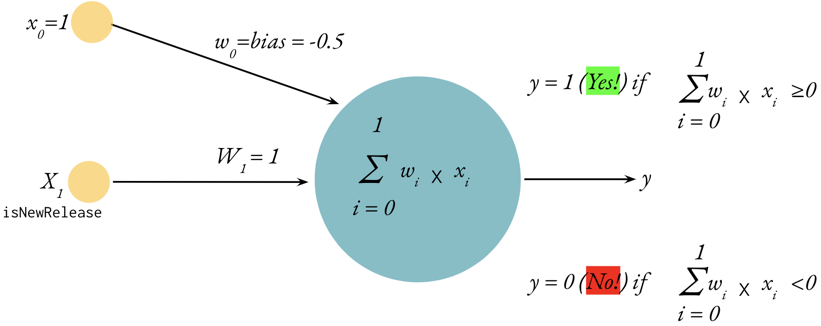
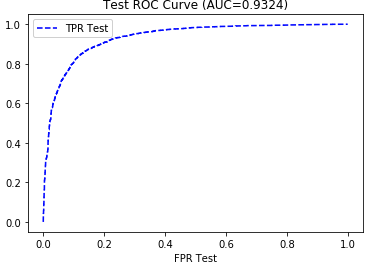
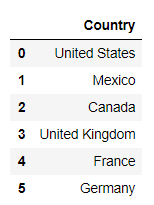
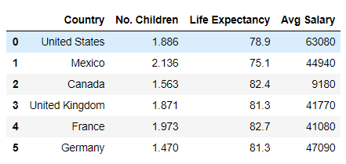
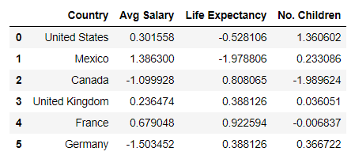
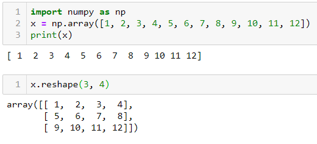
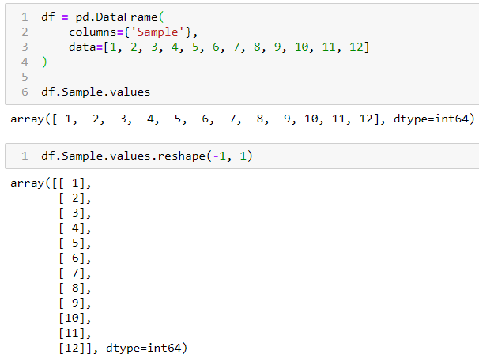

# Unit 13: Neural Networks

## Activation Functions for Deep Learning

* [Overview of different Optimizers for neural networks](https://medium.datadriveninvestor.com/overview-of-different-optimizers-for-neural-networks-e0ed119440c3)

* [Optimizers in Deep Learning](https://medium.com/analytics-vidhya/this-blog-post-aims-at-explaining-the-behavior-of-different-algorithms-for-optimizing-gradient-46159a97a8c1)

* [Activation Functions for Deep Learning](https://medium.com/@toprak.mhmt/activation-functions-for-deep-learning-13d8b9b20e#:~:text=Activation%20Functions%%5B%E2%80%A6%5Day.%204%20Softmax%20Function.%20)

* [7 popular activation functions you should know in Deep Learning and how to use them with Keras and TensorFlow 2](https://towardsdatascience.com/7-popular-activation-functions-you-should-know-in-deep-learning-and-how-to-use-them-with-keras-and-27b4d838dfe6)

## Loss Functions

* [Loss Functions Explained](https://medium.com/deep-learning-demystified/loss-functions-explained-3098e8ff2b27)

## ROC Curve and AUC

* [Understanding AUC - ROC Curve](https://towardsdatascience.com/understanding-auc-roc-curve-68b2303cc9c5)

* [Classification: ROC Curve and AUC - Google's Machine Learning Crash Course](https://developers.google.com/machine-learning/crash-course/classification/roc-and-auc)

* [Sci-kit learn roc_curve documentation](https://scikit-learn.org/stable/modules/generated/sklearn.metrics.roc_curve.html)

### FAQs

<details>
<summary>What are Neural Networks and what does the Perceptron have to do with it?</summary><br>

Neural networks are a set of algorithms that are modelled after the human brain - essentially a network of artificial neurons designed to recognise patterns and interpret sensory data through machine perception, labelling, or by clustering raw input. Neural networks complete this task with layers of neurons. Data goes into a layer, where mathematical computation is completed, then those results are fed into the next layer.

The original neural network and building block for modern neural networks is the perceptron. The perceptron is essentially a single neural network unit or neuron. Created by Frank Rosenblatt in 1958 and further developed in 1969 by Marvin Minsky and Seymour Papert, it's the most basic model of an artificial neuron, taking inputs, applying weights, and calculating a binary-weighted sum prediction. Neural networks are composed of groups of these neurons, called layers.



</details>

<details>
<summary>Are Neural Networks considered supervised learning or unsupervised learning?</summary><br>
Neural networks can fall into both categories! Neural networks can run unsupervised learning jobs such as mapping out patterns in text for NLP, or for clustering algorithms. They can also be used for supervised learning jobs such as image classification and object detection.<br>

<br>
<blockquote>
<details>

<summary>Supervised Learning</summary><br>

Supervised machine learning uses labelled data with input variables (feature data) and output variables (target data). It uses the feature data to predict the target data. Because the data is labelled, the outcome is known. This data can be fed to the model, and if the model guesses incorrectly, the error can be used to fine-tune the model until it makes highly accurate guesses.<br>

An example of this is using tuning forks to tune a piano. Tuning forks produce very precise tones. These tones are your known output. You can press a piano key and compare the piano's tone (model output) to the tuning fork (known y value). If the piano's tone is too low, then you can tighten the piano wire to make the piano better at matching the tuning fork. This process of adjusting the model to make the output match the known output is essentially supervised learning.

<br>
</details>
<details>
<summary>Unsupervised Learning</summary><br>
Unsupervised learning models are given only input variables and must work to make connections to the data without predicting a labelled target. These types of models are often clustering models that uncover connections in the data and group all the features into classes accordingly.<br>
<br>
An example of unsupervised learning would be to use website purchase data to group customers into two classes based on their spending habits. This clustering might reveal that class 1 more spends more with a coupon incentive, while class 2 spends more on targeted advertising on social media.
</details>

</blockquote><br>
</details>

<details>
<summary>Why do I need activation, loss, and optimiser functions?</summary><br>

<blockquote>
<details>
<summary>Activation Functions</summary><br>

Activation functions are really just math functions that allow us to adjust the linearity of the model. Data is complex and often has non-linear relationships between the inputs and the outputs. Changing the activation function to non-linear functions like ReLU allow us to build neural networks that can adapt to non-linear data.

Some of the most popular activation functions include sigmoid, tanh, and relu. A full list of activation functions provided by keras can be found [here.](https://keras.io/activations/)
</details>

<details>
<summary>Linear and non-linear data</summary>

Linearity is the property of data that allows it to be visually depicted as a straight line. When plotted, a linear dataset will appear to move in one direction, in a relatively straight line as seen below:


Conversely, a nonlinear dataset will appear to be anything other than a straight line. It might be a bell curve, jagged line or haphazard as seen in the example below:


Data points in a linear data set are proportionally separate with constant correlation, whereas non-linear data is disparately proportional with varying correlation.

Linear data is much easier to predict that non-linear data, because the trend is always present, moving in the same direction, however, neural networks are specially equipped to work with non-linear data, due in many parts to non-linear activation functions.

</details>
<details>
<summary>Loss Functions and Optimisers</summary><br>

Loss functions measure how far the model is deviating from the expected result - the higher the number, the more deviation, meaning poor performance. Optimiser functions help the loss functions minimise their error by updating the weights used in the model according to the loss. Optimiser functions fine-tune your model by using the loss function as a guide to keep it moving in the right direction. If the loss is going up, the optimiser needs to readjust the weights.

A simple way to visualise loss functions and optimisers is to picture yourself riding a horse. The horse may start to drift or find its own path, but you can use the reins to guide the horseback to the correct path. In this example, your eyes are the loss function. You can see the correct path, so you know when the model (the horse) starts to drift off course. Loss functions are just telling you how far off your model is from where you want it to be.

The horse reins are like the optimiser. The optimiser is what takes the feedback from the loss function and updates the model to make it better match your desired outcome. For example, if you see (loss function) that the horse is drifting to the right of the correct path (error), you can pull to the left to correct the course (optimiser).

Some popular loss functions include mean squared error (MSE) and categorical cross-entropy. Popular optimiser functions include Adam and Adadelta. A full list of loss functions and optimiser functions provided by Keras can be seen [here](https://keras.io/losses/) and [here,](https://keras.io/optimizers/) respectively.

 A great medium article on the topic can be viewed [here.](https://medium.com/datadriveninvestor/overview-of-different-optimizers-for-neural-networks-e0ed119440c3)

</details>
</blockquote><br>
</details>

<details>
<summary>How do I choose the best activation, loss and optimiser functions?</summary><br>

Choosing the right function for your model is a great opportunity to have some fun with your code through experimentation! Building neural networks is part science and part art, so choosing these functions is typically the result of much testing with different options to find the best result.

</details>

<details>
<summary>What is a Deep Neural Network?</summary><br>

Deep Neural Networks are neural networks that have more than one hidden layer. One can visualise this by thinking of a network of connected perceptrons, or a multi-layer perceptron. With Deep Neural Networks, there is an input layer and an output layer, but between the two are multiple hidden layers running sophisticated computations to produce more refined output. A layer is a set of neurons and is visualized by showing a column of those neurons and how they feed into the next column - or layer. Below is an image of a basic deep neural network, they can be, and often are, much more complex. To visualise even more types of deep neural nets and their structures, visit the [Tensorflow Playground.](https://playground.tensorflow.org/)


</details>

<details>
<summary>How are Neural Networks constructed using Keras?</summary><br>

Using Keras makes building Neural Networks relatively simple. In the following example, we'll build a simple deep neural network. We begin by importing the models needed to run the algorithms.

```python
from tensorflow.keras.models import Sequential
from tensorflow.keras.layers import Dense
```

Next we define our model by instantiating the `Sequential()` object, then we add our first hidden layer by calling the `.add()` method on our model object and inserting a `Dense()` layer with the proper variables:

```python
model = Sequential()
model.add(Dense(units=10, input_dim=5, activation='relu'))
```

In the above code snippet, we added '5' neurons to the hidden layer via the `units` parameter. We also gave `5` to our `input_dim` parameter and assigned the activation function `relu` to our `activation` parameter. The `input_dim` is always the starting number of inputs. The `units` parameter can vary.

In the below code snippet, we add a second hidden layer to the model, making this a deep neural network - notice we do not have to resupply the `input_dim`:

```python
model.add(Dense(units=15, activation='relu'))
```

Next, the output layer is added - notice we can specify a different activation function if we choose, and that the `units` are specified as `1` this time because this is the output layer, where a final prediction will be generated:

```python
model.add(Dense(units=1, activation="linear"))
```

Now that the model is built, a summary can be displayed by accessing the `.summary` method on the model as follows:


To continue the process, the model is compiled and fit to the data (trained). To compile the model we run `.compile()` on our model and specify a loss function, an optimiser, and also a metrics output to measure the accuracy. To fit the model, we run `.fit()`, providing the feature and target data, the data split to make validation results on, and the number of epochs. Remember, epochs is just another way of saying iterations, or the number of times we run the training:

```python
model.compile(loss="mean_squared_error", optimizer="adam", metrics=["mse"])
model.fit(X, y, validation_split=0.3, epochs=200)
```

Depending on the loss function and metrics designated, the output of fitting the model will resemble the following:


To use the model to make predictions you can call `.predict()` on scaled feature data as follows:

```python
predictions = model.predict(X_test_scaled)
```

</details>

<details>
<summary>What are ROC curve and AUC?</summary><br>

The ROC curve and AUC are used to visualise the performance of a classification model. ROC stands for Receiver Operating Characteristic, and AUC stands for Area Under the ROC Curve. The two methods are combined onto a single chart to produce the visualisation.

The Roc Curve, on its own, shows how the model performed by measuring the recall (See below for a quick refresher on recall) and false positive rate (FPR). A ROC curve is seen in the below image:


Because interpreting the ROC Curve is difficult, the AUC calculation comes into play. The AUC measures the area that falls under the curve on a scale of 0 to 1. If the model is 100% wrong, then the AUC is 0. If the model is 100% right, then the AUC is 1. An example of this final visualisation is seen in the below image:



<blockquote>
<details>
<summary><strong>Recall</strong></summary>
Recall is the measurement of how many times a value was predicted and was also incorrect. For example, if our model was predicting colours - blue, green, and purple, recall would be the measurement of how many times green was predicted incorrectly.

The formula for recall is TP / (TP + FN).

</details>
</blockquote><br>
</details>

<details>
<summary>How is Training and Testing Data Utilised?</summary><br>

When working with models, data is divided into training and testing sets. The training set is used to teach (supervise!) the model, so it learns how the input data is connected to the output data and can make predictions. The testing data set is used to validate how well the model performs on data it has not seen before, by running the model on the testing feature data, and comparing it's predictions to the testing target data.<br>

</details>
<details>
<summary>How does `train_test_split()` work?</summary><br>

The `train_test_split()` function makes splitting data for testing easy! The function outputs four sets of data points - two sets each of target and feature data where one set is for training, and one set is for testing. This is why the variables that define the function are typically `X_train, X_test, y_train, y_test`. The most important parameters of the function are the `X` and `y`. During preprocessing, we separate our data into the feature data, or `X`, and the target data - `y`.

The `y` data are the values we wish to predict, and the `X` data are the values we use to influence our predictions. If our data is stored in a DataFrame, we just break it out and store it in variables. The values we wish to predict are stored as `y` and the features we are using to make our predictions are stored as `X`. We then feed these into the `train_test_split()` function.

Other parameters include: `stratify`, `test_size`, `train_size`, `random_state`, and `shuffle`.

If the `y` values consist of binary data (for example, male/female), and 25% of those values are male, and 75% of those values are female, then setting the `stratify` parameter to `y` will ensure the test and train data have the same ratio of male to female as the entire data set.

The specific `test_size` and `train_size` can also be set to override the default sizes. The default for these parameters will select sizes that complement the data set. The defaults can be overridden using either `int` or `float` values. If the parameter is set to `int`, then this will indicate a specific sample size you wish to include in the test or train set. If the parameter is set to `float` then it will indicate a percentage of the total dataset you wish to include in the test or train set.

When using the `shuffle` parameter, the data is shuffled (randomised) prior to being divided into train and test sets.

When using this function, the data is split each time randomly; however, if the `random_state` parameter is set, the same random split will be selected each time. To use this parameter, any number can be used as the `random_state` as long as it is used each time you run the model. Using this parameter will always ensure the same split is obtained even if `shuffle` is set to `True`.

An example of implementing a `train_test_split()` instance is as follows:

```python
X_train, X_test, y_train, y_test = train_test_split(X, y, stratify=y, shuffle=True)
```

</details>

<details>
<summary>How do you preprocess data for neural networks?</summary><br>

Preprocessing data for neural networks involves converting categorical data to numerical and scaling numerical data with high variance. Categorical data is text-based and must be converted to numerical so that computations can be ran. Numerical data with high variance can inadvertently introduce bias to the model.

<blockquote>
<details>
<summary>Preprocessing Categorical Data</summary><br>

Using `OneHotEncoder()` from scikit-learn, we can convert categorical data to numerical. We begin with a simple DataFrame showing 6 countries:



Then we import `OneHotEncoder` from sklearn.preprocessing, after which we instantiate the `OneHotEncoder()` object, then run a `.fit()` followed by `.transform()`. The results are stored in a new variable `encoded_y`.

Now you can see that the encoded values are numerical representations of the original countries:


</details>

<details>
<summary>Scaling Feature Data</summary><br>
In an effort to avoid introducing bias to the model, we should scale data that have large numerical variance between features, so that all features are weighted the same. For example, let's suppose that our country DataFrame also includes an average number of children, average life expectancy, and average salary by country. The average number of children is a very small number compared to average life expectancy, which is a very small number compared to the average salary by country. These values vary greatly and need to be scaled, because the higher numbers may result in more weight bias.



Using the `StandardScaler()` from scikit-learn, we will scale the data. First we instantiate the `.StandardScaler()` instance, then fit it to the data, then transform the data and show it in a new DataFrame:

```python
data_scaler = StandardScaler()
data_scaler.fit(df)
data_scaled = data_scaler.transform(df)
```

The new DataFrame shows the scaled data in place of the former values. Now all the values are standardised:



</details>
</blockquote><br>
</details>

<details><summary>
What is .reshape() and why do I have to use it?</summary><br>

When working with Pandas, we often pass Series objects into our model. The shape of values in a Pandas Series object is a 1d array. This has to be converted into a 2d array, which is essentially an array of arrays - or list of lists. This is done using the `.reshape()` function. The matrix values we desire are passed into this function. In the following example, we reshape our list into a 2d array using `.reshape(3,4)`, where 3 is the number of lists, and 4 is the number of values in each list:



Many models require the 2d array to be formatted such that each value is in a list by itself. If we were inserting the above sample data into a model, it would be converted using `.reshape(-1,1)`, where -1 indicates an unknown number of rows, and 1 indicates the number of values in each list. The -1 will allow the function to generate the number of rows necessary to hold the data. The output looks like this:



</details>

---
© 2022 edX Boot Camps LLC. Confidential and Proprietary. All Rights Reserved.
