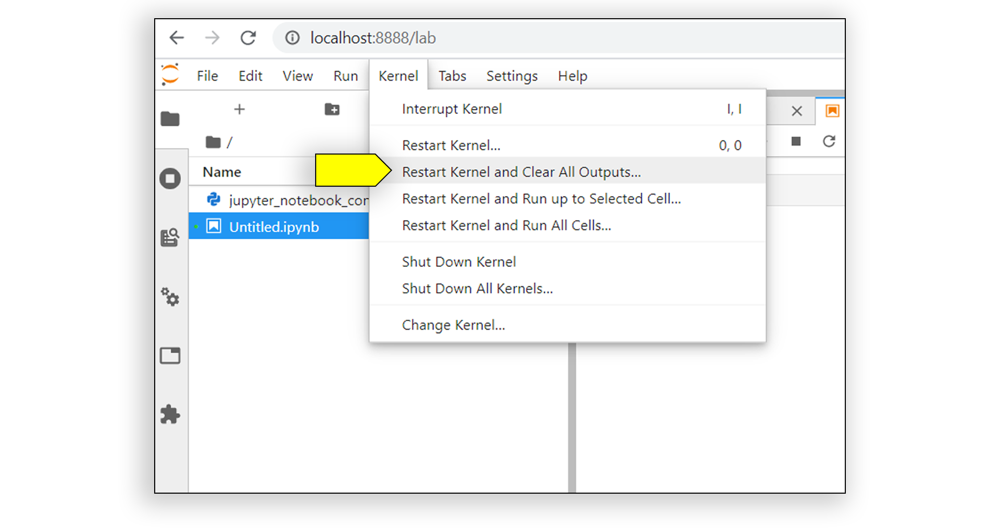
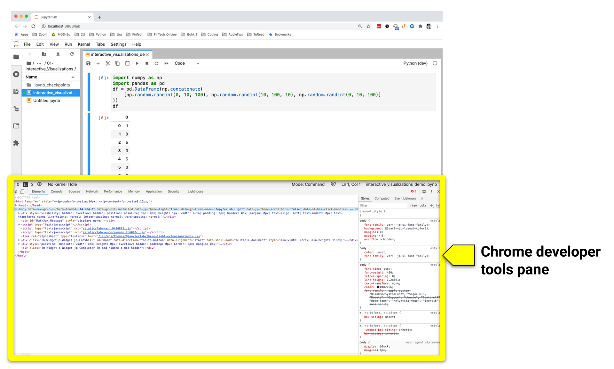
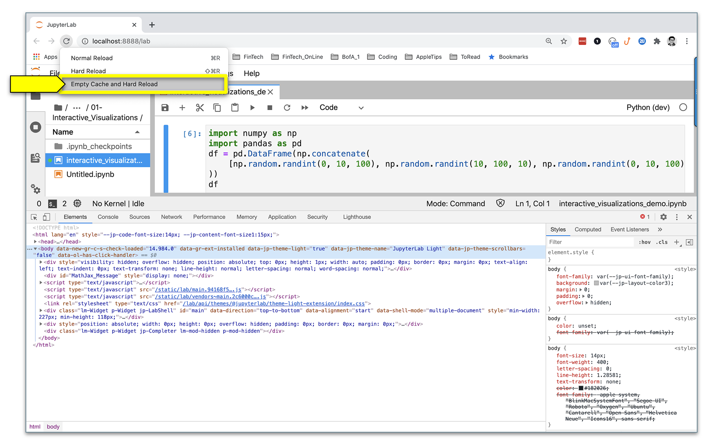

# Algorithmic Trading Install Guide

This guide serves as a step by step process for setting up and validating the packages and files needed to work on the activities of this unit.

All packages should be installed into the `algotrading` virtual environment. If you have not already created an `algotrading` virtual environment you can do so by typing the following commands in your terminal:

```shell
conda create -n algotrading python=3.7 anaconda
```

---

## Required Libraries

In this unit, you will use the following Python libraries that you used in previous. You have them installed already in your virtual environment since they are part of the core packages of Anaconda. If you decided to create a new virtual environment, please refer to the troubleshooting section.

* Pandas

* NumPy

* Matplotlib

* scikit-learn

### Install the PyViz Ecosystem

PyViz is a Python visualization package that provides a single platform for accessing multiple visualization libraries. One of these libraries is hvPlot, which you’ll use during this module.

To install PyViz and its dependencies in your Conda `algotrading` environment, complete the following steps:

1. From your terminal, activate your Conda `algotrading` environment.

    ```shell
    conda activate algotrading
    ```

2. Install the PyViz packages by using the `conda install` command as follows:

    ```shell
    conda install -c pyviz hvplot
    ```

    > **Note** For some installations, you might get a message indicating that the requested packages are already installed. This is fine&mdash;Conda automatically installs the software dependencies that these libraries require.

### Installing the FinTA Library

[FinTA](https://pypi.org/project/finta/) is a this library to generate technical indicator values used in several trading algorithms.

To install FinTA and its dependencies in your Conda `algotrading` environment, complete the following steps:

1. From your terminal, activate your Conda `algotrading` environment.

    ```shell
    conda activate algotrading
    ```

2. Install the FinTA package by using the `pip install` command as follows:

    ```shell
    pip install finta
    ```

### Confirm installation of PyViz and Finta

Confirm the installation of all the PyViz packages by running the following commands:

```shell
conda list hvplot
conda list finta
```

The following image shows the responses, which list the installed packages.

> **Important** Make sure to use hvPlot version 0.7.0 or later


## Troubleshooting

### Troubleshooting Guide for Blank Plots

Rendering visualizations in hvPlot can occasionally be troublesome. If your plot doesn’t render in your JupyterLab preview, try the processes in each of the following sections to help you resolve the issue.

#### Clear the Cache that’s Associated with the Notebook Kernel

In your Jupyter notebook, on the Kernel menu, click “Restart Kernel and Clear All Outputs,” as the following image shows:



This clears all the existing cell outputs and automatically reruns the notebook from the first cell down.

#### Clear the Cache from the Chrome Browser

If you’re using Google Chrome to host JupyterLab, complete the following steps:

1. In the Chrome browser window, press Option+Command+I (for macOS users) or Ctrl+Shift+I (for Windows users). The developer tools pane opens, as the following image shows:

    

2. With the Chrome developer tools pane open on the JupyterLab page, click and hold the browser reload button. This forces a dropdown menu to appear. On this menu, click “Empty Cache and Hard Reload,” as the following image shows:

    

If clearing both the kernel and the Chrome browser cache doesn’t work, proceed to the instructions in the next section.

#### Recreate Your Conda Environment

If your plots still don’t properly render after clearing both your kernel and Chrome browser caches, the next step is to recreate your Conda `algotrading` environment. To do so, complete the following steps:

1. Quit any running applications, such as JupyterLab. Then deactivate your current Conda `algotrading` environment by running the following command:

    ```shell
    conda deactivate
    ```

2. Update the Conda environment by running the following command:

    ```shell
    conda update conda
    ```

3. Create a new Conda `algotrading` environment by running the following command:

    ```shell
    conda create -n algotrading python=3.7 anaconda
    ```

4. Activate the new environment with the following command:

    ```shell
    conda activate algotrading
    ```

5. Install PyViz and FinTA again by following the steps in the “Required Libraries” section that appears earlier in this guide.

If your plots still don’t render, reach out to your instructional team for assistance.

---

© 2022 edX Boot Camps LLC. Confidential and Proprietary. All Rights Reserved.
