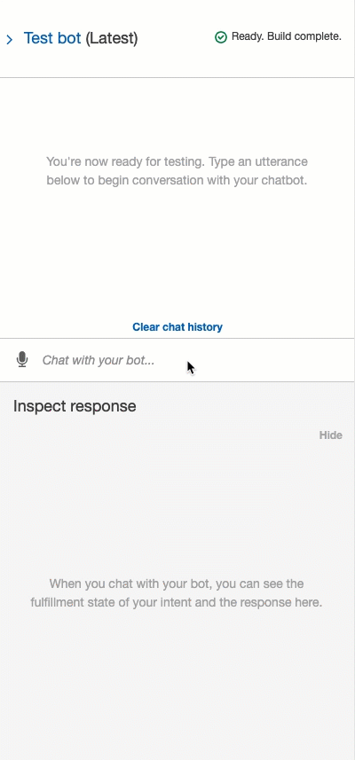

# Building and Testing the Robo Advisor

In this activity, you’ll use the Amazon Lex console to build and test your Bitcoin Fear & Greed Robo Advisor.

## Instructions

1. Click the Build button, and then wait for the build process to finish.

2. Test your bot by using the sample utterances. The following animation shows an example of the conversation flow:

    

    The preceding animation includes the following conversation:

    * Person: I want to buy bitcoin

    * Bot: How many dollars do you want to buy?

    * Person: 100

    * Bot: Are you sure you want to buy $100 in bitcoin?

    * Person: Yes

    * Bot: Intent getFGIndex is ReadyForFulfillment: amount: 100

---

© 2022 Trilogy Education Services, a 2U, Inc. brand. All Rights Reserved.