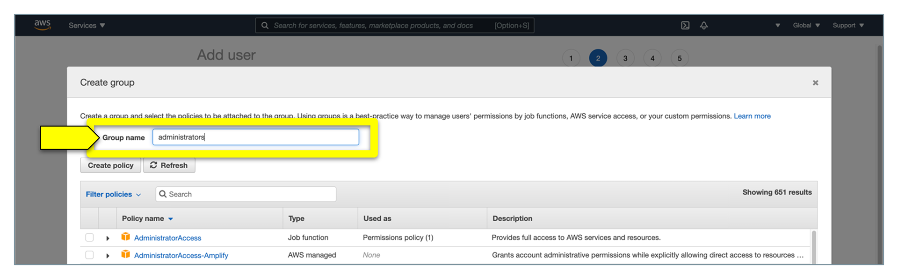
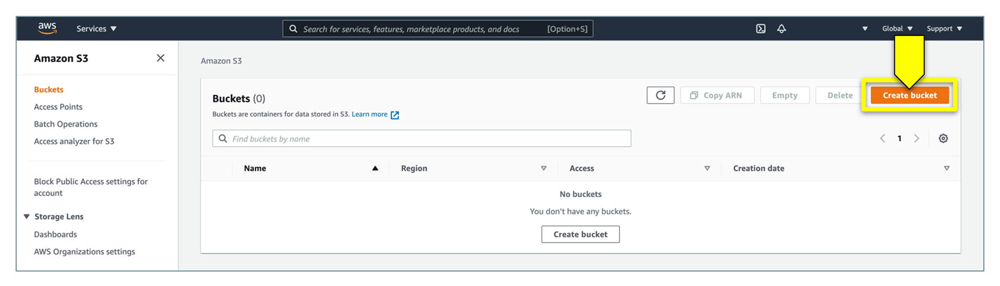
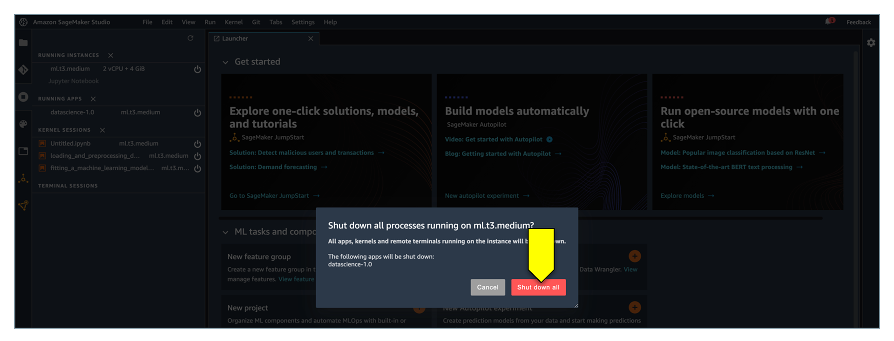
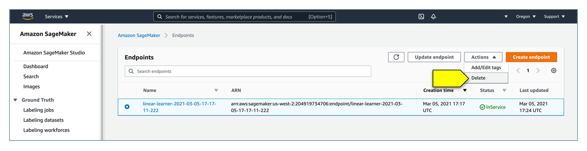

# AWS Account Setup

In this unit, you won’t install any software on your computer. Instead, you’ll use the following AWS services, which you’ll need to set up before starting the first lesson:

* AWS Billing

* Amazon Simple Storage Service (Amazon S3)

* Amazon SageMaker

* Amazon Lex

* Amazon Lambda

* AWS Identity and Access Management (IAM)

In the following sections, you’ll perform the basic setup that you’ll need to successfully accomplish each lesson.

**Important:** In the following sections, the screenshots and descriptions of the AWS user interface appear as they exist at the time of this writing. But, you might find slight differences because of updates.

## Use the AWS Free Tier

Use the AWS free tier as detailed in the [Amazon Web Services Free Tier](AWS-Free-Tier.md) file.

## Create and Activate an AWS Account

The [AWS](https://aws.amazon.com/what-is-aws/) platform provides on-demand cloud computing services to individuals, companies, and governments on a metered, pay-as-you-go basis. If you’ve never used this platform, you first need to create and activate your AWS account. So, this section divides the process into the following four parts:

1. Create your account

2. Add a payment method

3. Verify your phone number

4. Choose an AWS support plan

The following subsections detail the steps to complete for each part.

### Part 1: Create Your Account

1. Go to the [AWS homepage](https://aws.amazon.com/).

2. Click the “Create an AWS account” button, as the following image shows:

    **Note:** If “Create a new AWS Account” doesn’t appear on the page, first click “Sign In to a Different Account,” and then click “Create an AWS Account.”

    

    If you've recently signed in to AWS, a “Sign In to the Console” button might appear instead, as the following image shows:

    

3. Enter your account information, and then click the “Continue (step 1 of 5)” button, as the following image shows:

    

    Ensure that you correctly enter your account information, especially your email address. If you incorrectly enter your email address, you won't be able to access your account.

4. When requested during the sign-up process, choose the Personal account type (unless you’re creating an account for a business).

    **Note:** Personal and professional accounts have the same features and functions. We recommend a personal account for this module.

5. Complete your personal (or business) information.

6. Be sure that you read and understand the terms of the [AWS Customer Agreement](https://aws.amazon.com/agreement/).

7. Click “Create Account and Continue.”

    **Important:** You’ll receive an email to confirm your account creation. You’ll then be able to sign in to your new account by using the email address and password that you supplied. But, you won’t be able to use AWS services until you finish activating your account.

### Part 2: Add a Payment Method

Although creating an account is free, you need to provide a valid credit card that allows Amazon to charge you for any service usage beyond the limits of the free tier.

After you confirm your account, the Payment Information page displays. Enter the information for your payment method, and then click “Secure Submit.”

**Note:** If you want to use a different address for your AWS account, click “Use a New Address” before you click “Secure Submit.”

### Part 3: Verify Your Phone Number

1. Choose whether you want to verify your account by “Text message (SMS)” or by “Voice call.”

2. Choose your country or region code from the list.

3. Enter a phone number where you can be reached in the next few minutes.

4. Enter the code that the CAPTCHA test displays.

5. When you're ready, click “Contact me.” In a few moments, an automated system will contact you.

    **Note:** If you chose to verify your account by “Text message (SMS),” click “Send SMS” instead.

6. Enter the verification code that you receive by SMS or voice call, and then click Continue.

### Part 4: Choose an AWS Support Plan

On the “Select a Support Plan” page, choose one of the available support plans. For this module, we won't need any support. We'll use Basic Support, which is included for all AWS customers.

For descriptions of the available support plans and their benefits, see [Compare AWS Support Plans](https://aws.amazon.com/premiumsupport/features/).

**Important:** After you choose a support plan, a confirmation page indicates that your account is being activated. Accounts usually activate within a few minutes but might take up to 24 hours. You can sign in to your AWS account during this time. The AWS homepage might display a “Complete Sign Up” button during this time&mdash;even if you've completed all the steps in the sign-up process. When your account is fully activated, you'll receive a confirmation email. You’ll then have full access to all AWS services.

Congratulations! You’ve created and activated your AWS account.

## Set Your Usage Alerts

To avoid unwanted charges to your credit card, we encourage you to turn on an option so that you’ll receive an email alert when your AWS free tier service is about to exceed a usage limit. To turn on this option, complete the following steps:

1. On the [AWS Management Console](https://aws.amazon.com/console/) homepage, in the search box, type billing, and then in the list of results that displays, click Billing, as the following image shows:

    

2. In the left navigation pane of the Billing section, click “Billing preferences.”

3. In the Billing Preferences pane on the right side, select the “Receive Free Tier Usage Alerts” checkbox, and then in the Email Address box, type the email address where you want to receive the usage alerts. Then select the "Receive Billing Alerts" checkbox to receive alerts of your spending on AWS. To finish, click the "Save preferences" button, as the following image shows:

    

That’s it! If for any reason, you’re about to reach a usage limit of the free tier, you’ll receive an email alert.

## Troubleshoot Any Account Activation Delays

As mentioned earlier, account activation can be delayed. If the process takes more than 24 hours, try the following:

* Finish the account activation process. You might have accidentally closed the window for the sign-up process before you added all the necessary information. To finish the sign-up process, open the [AWS Management Console](https://aws.amazon.com/console/), and then sign in by using the email address and password that you chose for the account.

* Check the information that’s associated with your payment method. Check [Payment Methods](https://console.aws.amazon.com/billing/home#/paymentmethods) in the AWS Billing and Cost Management console. Fix any errors in the information.

* Contact your financial institution. Financial institutions occasionally reject authorisation requests from AWS for various reasons. Contact the issuing institution for your payment method, and ask them to approve authorisation requests from AWS.

  **Note:** AWS cancels the authorisation request as soon as your financial institution approves it. You won’t be charged for authorisation requests from AWS. An authorisation request might still appear as a small charge (usually $1) on statements from your financial institution.

* Check your email for requests for additional information. AWS might need information from you to complete the activation process.

* Try a different browser.

* Contact [AWS Support](https://aws.amazon.com/support) for help. Be sure to mention any troubleshooting steps that you already tried.

  **Note:** Don't provide sensitive information, such as credit card numbers, in any correspondence with AWS.

## Create an Administrator User

In this section, you’ll create an administrator user with the AWS Identity and Access Management (IAM) service. This user will add more security when you work in AWS.

A best practice is to avoid using the principal user, or **root user**, to manage your AWS account. This user is the one that you used to create your AWS account. Instead, you should create a new user for each person that requires administrator access by using the AWS IAM service.

To create an IAM user, open the [AWS Management Console](https://console.aws.amazon.com) by using your root user, and then complete the following steps:

1. In the search box, type “iam,” and then click “IAM” in the list of results that display, as the following image shows:

    

2. In the left navigation pane, click Users. In the “IAM users” pane on the right side, click the “Add user” button, as the following image shows:

    

3. On the “Add user” page that appears, set the user details as follows:

    * In the “User name” box, type administrator.

    * In the “Access type” area, select the “Programmatic access” and “AWS Management Console access” checkboxes.

    * In the “Console password” area, select the “Custom password” option, and then in the box, type your password.

    * In the “Require password reset” area, clear the “User must create a new password at next sign-in” checkbox.

    The following image shows this step:

    

4. Click the “Next: Permissions” button to continue. To set permissions, click “Add user to group, and then click the **Create group** button, as the following image shows:

    

5. In the “Create group” dialogue box that appears, in the “Group name” box, type administrators, as the following image shows:

    

6. Click “Filter policies,” and then on the drop-down menu that appears, select the “AWS managed - job function” checkbox, as the following image shows:

    

7. In the policy list, select the checkbox for the AdministratorAccess policy name, and then click the “Create group” button, as the following image shows:

    

8. The “Create group” dialogue box closes. Back on the “Add user” page, in the “Add user to group” area, select the checkbox for your new administrators group. If necessary, click the Refresh button to display the group in the list, as the following image shows:

    

9. Click the “Next: Tags” button to continue.

10. On the “Next: Tags” page, leave the defaults, and then click the “Next: Review” button to continue.

11. Review your choices, which the page displays. When you’re ready to proceed, click the “Create user” button, as the following image shows:

    

12. Once the user is created, a Success message appears. Click the “Download .csv” button to download the user's credentials, and keep those credentials in a safe location. The following image shows this step:

    

### Enable Access to Billing Data

After creating the administrator user, you need to give this user access to the billing data. To do so, complete the following steps:

1. On the navigation bar across the top of the window, click your account name, and then on the drop-down menu that displays, click My Account, as the following image shows:

    

2. Scroll down to the “IAM User and Role Access to Billing Information” section, and then click the Edit button, as the following image shows:

    

3. Select the Activate IAM Access checkbox, and then click the Update button, as the following image shows:

    

Sign out from your session with the main user, open the CSV file with the new administrator user credentials that you saved earlier, and then sign in to the AWS Management Console by using the URL and password of this new user. From now on, avoid using your main user, and work with this new administrator user instead.

## Create an Amazon S3 Bucket

In this unit, you’ll need to store files in the cloud to run machine learning models in the cloud. To do that, you'll use [Amazon S3](https://aws.amazon.com/s3), which is a cloud data storage service that AWS provides.

To create an Amazon S3 bucket, complete the following steps:

1. On the S3 services page, in the Find Services search box, type S3, and then in the Services list that displays, click S3, as the following image shows:

    

2. In the Amazon S3 console that appears, click the “Create bucket” button, as the following image shows:

    

3. On the “Create bucket” page, in the “General configuration” area, set the details as follows:

    * In the “Bucket name” box, type “fintech-bootcamp-activities-” followed by the initials of your name, then another hyphen, and then the current date (using hyphens to separate digits). Make a special note of this bucket name, because you'll need it later. Here’s an example of what to type in the box:

      fintech-bootcamp-activities-jams-2021-02-11

      **Important:** Each Amazon S3 bucket should have a unique name across the entire AWS space, so ensure that your bucket name is unique. You can do so by adding your initials and the current date to the bucket name. Be aware that a bucket name can’t contain uppercase letters.

    * In the Region drop-down list, select “US West (Oregon) us-west-2.”

      The following image shows this step:

      

4. In the "Block Public Access" section:

    * **Uncheck** the box next to "Block all public access".

    * **Check** the resulting acknowledgement box.

    

5. Leave the rest of the options with their default values, scroll down to the bottom of the page, and then click the “Create bucket” button, as the following image shows:

    

6. Note that a “Successfully created bucket” confirmation message displays, as the following image shows:

    

You’re done with the initial setup! Either write down or copy, paste, and save the bucket name for use in the activities of this unit.

## Avoid Additional Costs

Even if you set usage alerts, it’s possible to incur additional costs while using AWS. For example, you can accidentally incur a cost by leaving an Amazon SageMaker instance running for several days.

**Important:** To avoid incurring unnecessary AWS costs, carefully read this section, and closely follow the guidelines that it outlines.

You’ll learn more about SageMaker later in this unit. But before you start using AWS, it’s crucial that you understand how to stop and delete services once you’ve finished using them.

### Stop Amazon SageMaker Studio Instances

As you’ll learn later in this unit, Amazon SageMaker Studio is a service that AWS provides.With SageMaker Studio, you can run Jupyter notebooks in the cloud that build and run machine learning models. Its user interface resembles that of JupyterLab, so the process of stopping a running instance might seem familiar. But, it differs in small but significant ways&mdash;so, pay close attention to the process that this section details.

As just mentioned, you can use SageMaker Studio to run notebooks in the cloud. Every time that you use SageMaker, AWS creates a virtual machine to host the cloud-based notebook. This virtual machine is called an **instance**.

When you finish working in SageMaker Studio, you must stop running all the instances. If you don’t, AWS will charge your credit card. For the latest AWS-related costs, you can review the [Amazon SageMaker Pricing](https://aws.amazon.com/sagemaker/pricing/) page.

To stop an instance, complete the following steps:

1. In Sagemaker Studio, on the left navigation bar, click the “Running Terminal and Kernels” button, as the following image shows:

    

2. Note that a list of all the running resources appears. To stop them all, you need only to shut down the running instance. To do so, in the Running Instances section, click the “Shut down” button, as the following image shows:

    

3. Note that a warning message displays, asking if you want to shut down all processes running on the instance. Click the “Shut down all” button, as the following image shows:

    

4. Be aware that the system takes a few seconds to shut down all the running resources. Check the display to ensure that it no longer lists any resources (which means that all the resources have stopped running), as the following image shows:

    

### Manually Delete Amazon SageMaker Endpoints

Each time that you build a model in SageMaker, an endpoint gets created. Later in this unit, you’ll learn how to delete endpoint instances by using Python code. But, we encourage you to check that you’ve successfully deleted all the endpoints each time that you finish a working session in SageMaker.

If you leave any endpoints running beyond the minutes that the free tier offers, AWS will charge your credit card.

To ensure that you don’t leave any endpoints running, complete the following steps:

1. In the Amazon SageMaker console, in the left navigation menu, click Endpoints, as the following image shows:

    

2. Note that the Endpoints pane appears (on the right side). If the pane doesn’t list any endpoints but displays the “There are currently no resources” message, no endpoints are running, and you don’t need to do anything further, as the following image shows:

    

3. If the Endpoints pane lists any endpoints, select the endpoint that you want to delete, as the following image shows:

    

4. Click the Actions drop-down menu, and then click Delete, as the following image shows:

    

5. Note that a dialog box appears with the following warning message: “This will permanently delete your endpoint and cannot be undone. This may affect other resources.” Click the Delete button, as the following image shows:

    

6. Note that status of the endpoint changes to Deleting, as the following image shows:

    

7. Wait a few minutes. When the endpoint is deleted, it will no longer appear in the Endpoints pane.

8. Remember that if you have several endpoints running, you’ll need to delete them one by one.

### Delete Amazon S3 Buckets

To avoid incurring additional costs for using cloud storage space in Amazon S3, you should delete any bucket that you create at the end of the unit.

To delete a bucket, complete the following steps:

1. Delete any files or resources that are stored in the bucket.

2. Open the [Amazon S3 console](https://s3.console.aws.amazon.com/s3/home). In the left navigation pane, click Buckets. In the Buckets pane that appears (on the right side), select the bucket that you want to delete, and then click the Delete button, as the following image shows:

    

3. Note that the “Delete bucket” page appears. In the “To confirm deletion, type the name of the bucket” box, type the name of the bucket, and then click the “Delete bucket” button, as the following image shows:

    

4. Note that when your bucket is deleted, it no longer appear in the Buckets pane, as the following image shows:

    

---

© 2022 Trilogy Education Services, a 2U, Inc. brand. All Rights Reserved.
