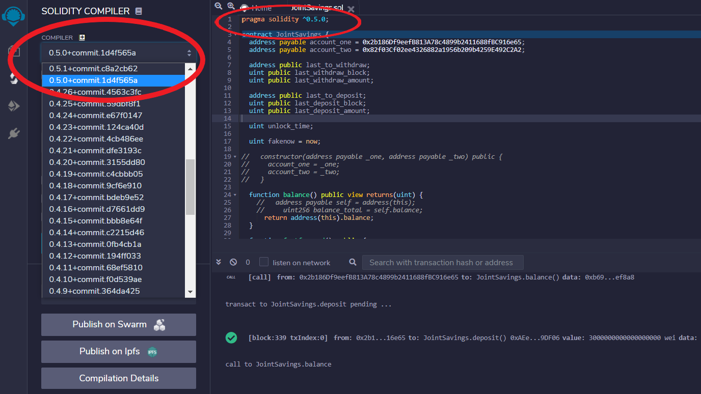
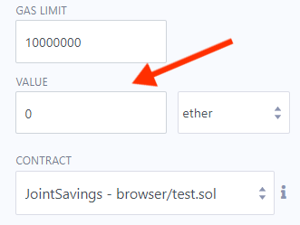
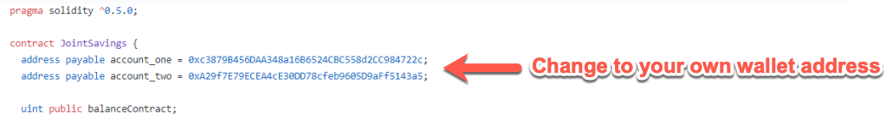
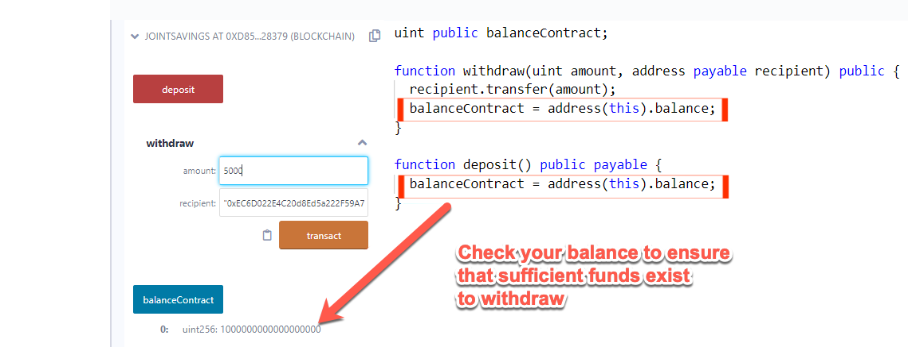

# Unit 20: Solidity

## Variables and Parameters

Check out the following resources to learn more about variables and parameters. 

* [Local and State Solidity Variables and Use of Parameters](https://www.bitdegree.org/learn/solidity-variables)

* [Local variable and state variable, and the difference between them](https://ethereum.stackexchange.com/questions/25554/local-variable-and-state-variable-and-the-difference-between-them)

* [Why constant variables inside functions fail to compile in Solidity?](https://ethereum.stackexchange.com/questions/51366/why-constant-variables-inside-functions-fail-to-compile-in-solidity)

## Control Structures

Check out the following resources to learn more about control structures.

* [Control Structures in Ethereum](https://medium.com/@k3no/control-structures-in-ethereum-3f2d4149b84a)

* [What difference between if and require in Solidity](https://ethereum.stackexchange.com/questions/60585/what-difference-between-if-and-require-in-solidity)

## Compiling

To compile a contract by using the Remix IDE, you just choose a compatible compiler version and then click Compile. To avoid unexpected errors, it’s best to set your Remix compiler version to match your pragma, as the following image shows:



In the preceding image, notice that in the Remix IDE, in the Solidity Compiler pane, in the Compiler drop-down list, 0.5.0 is selected. And in the code editor pane, the first line of code is as follows:

```solidity
pragma solidity ^0.5.0;
```

## Troubleshooting Gas Estimation Errors

As you navigate Solidity and smart contracts, the most common error that you'll get might be the “Gas estimation failed” error. This error is troublesome. That’s because it serves as a catchall error, delivering a vague message that offers little guidance about what caused it, as the following image shows:

![A screenshot depicts the “Gas estimation failed” error.] (Images/gas_estimation_failed.png)

Here are some possible causes that will help you troubleshoot the issue:

* The Value box must be empty on deployment. After deployment, certain functions require a value in this box. If you’re deploying, make sure that this box is empty. If you’re running a function that requires a value, such as the `deposit` function, make sure that you enter a value in this box, as the following image shows:

  

* If the contract calls for a wallet address variable, you’ll need to replace any hardcoded address in the provided code with your own address, as the following image shows:

  

  Similarly, some contracts call for the owner of the contract to be the user. In these cases, make sure that you’re connected to the contract owner address in MetaMask.

* The contract must have sufficient funds to withdraw the designated amount. Use a balance checker&mdash;like `balanceChecker` from the `JointSavings` contract activities&mdash;to check your balance. If you're writing your own contract, add your own balance checker to make sure that you have enough funds, as the following image shows:

  

In the preceding image, notice that we can verify the current balance of our contract in the Remix IDE by using the `balanceContract` function.

* Some contracts are designed to end with an error if certain conditions aren’t met. In those instances, you might get the gas estimation error. You can find one example of this in the time lock activities from class. If you get an unexpected error with these activities, make sure that you use the `fastforward` function to override the time lock&mdash;and thus allow the contract to operate.

## Resources

Check out the following resources related to Ethereum. 

* [Building Ethereum dApps, Roberto Infante, Manning](https://www.manning.com/books/building-ethereum-dapps)

* [Ethereum Developer Resources](https://ethereum.org/developers/#getting-started)

---

© 2022 edX Boot Camps LLC. Confidential and Proprietary. All Rights Reserved.
