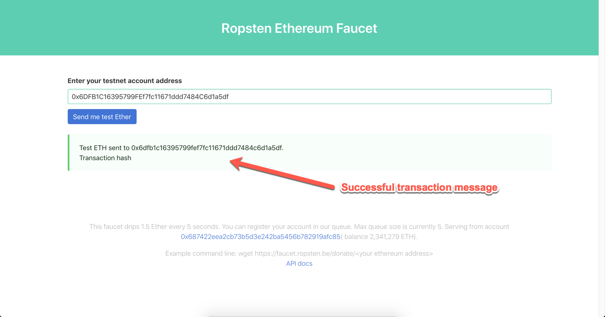

# Getting Ropsten Tokens

The Ropsten test network allows developers to test their applications using the Ethereum blockchain. We recommend getting your test tokens before the class.

To ask for test ETH tokens in this network, complete the following steps. It is assumed that you have already installed the MetaMask plugin in your web browser.

1. Open your browser and navigate to the Ropsten network faucet at <https://faucet.ropsten.be/>.

2. Enter your wallet address and click the "Send me test Ether" button.

3. If the transaction is successful, you will see the following confirmation message.

    

   After a few minutes, you will receive at least 1 ETH test token in your wallet.

---

© 2022 edX Boot Camps LLC. Confidential and Proprietary. All Rights Reserved.
