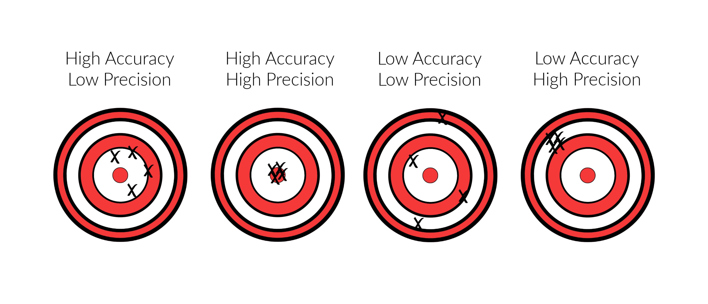
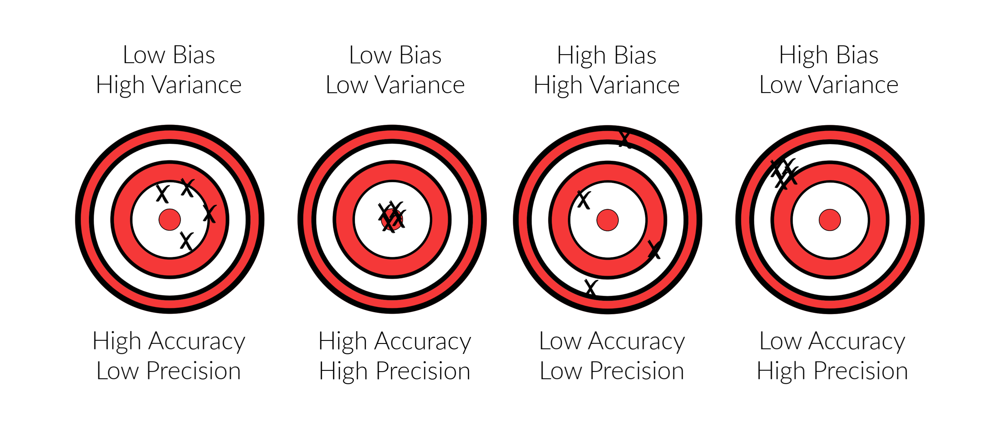

# Unit 11: Classification

## Helpful Links
### The Confusion Matrix and Other Metrics

*  Additional Confusion Matrix Code Examples over at [Scikit-learn Documentation](https://scikit-learn.org/stable/modules/generated/sklearn.metrics.confusion_matrix.html)

*  [Walkthrough](https://www.kaggle.com/diegosch/classifier-evaluation-using-confusion-matrix) of a Model Using and Interpreting a Confusion Matrix

### Machine Learning with Imbalanced Data

* Imbalanced Learning Package [Documentation](https://imbalanced-learn.readthedocs.io/en/stable/index.html)

* Another Applied [Walkthrough](https://www.kaggle.com/rafjaa/resampling-strategies-for-imbalanced-datasets) Using the imbalanced-learn Package


---

## Additional Course Resources

*  An [interview](https://insights.som.yale.edu/insights/will-machine-learning-transform-finance) with the head of machine learning at Goldman Sachs (an investment bank) on how ML is transforming finance.

* An Example of Applying Binary Classification ML Models to [Trading Currencies.](http://nrl.northumbria.ac.uk/34544/1/Evaluating%20machine%20learning.pdf)
  *  This paper, published in Expert Systems, looks at dozens of different ML models, including logistic regression trees and setting up a binary classification problem (i.e., up or down days, y = '0' or '1') in order to trade currencies. A few models perform poorly, but some generate average returns as high as 20% per year.

*   Quantitative asset management has only recently been applying machine learning, but is [realizing big benefits from doing so.](https://dachxiu.chicagobooth.edu/download/ML.pdf)
    *  This paper from academics at The University of Chicago and AQR (a large quantitative hedge fund manager) compares the performance of traditional statistical models used to forecast stock returns to the performance when deploying machine learning techniques (including random forests, but also many of the techniques we’ll learn in subsequent units). While dense, consider reading if you’re interested in a detailed contrast between traditional methods for forecasting stock returns and those involving machine learning.

## FAQs

<details>
<summary>What is the difference between supervised learning and unsupervised learning?</summary><br>
<blockquote>
<details>
<summary>Supervised Learning</summary><br>

Supervised machine learning uses labeled data with input variables (feature data) and output variables (target data) and uses the feature data to predict the target data. Because the data is labeled, the outcome is known. This data can be fed to the model, and if the model guesses incorrectly, the error can be used to fine tune the model until it makes highly accurate guesses.<br>

An example of this is using tuning forks to tune a piano. Tuning forks produce very precise tones. These tones are your known output. You can press a piano key and compare the piano's tone (model output) to the tuning fork (known y value). If the piano's tone is too low then you can tighten the piano wire to make the piano better at matching the tuning fork. This process of adjusting the model to make the output match the known output is essentially supervised learning.
<br>
</details>
<details>
<summary>Unsupervised Learning</summary><br>

Unsupervised learning models are given only input variables and must work to make connections to the data without predicting a labeled target. These types of models are often clustering models that uncover connections in the data and group all the features into classes accordingly.<br>
<br>
An example of unsupervised learning would be to use website purchase data to group customers into two classes based on their spending habits. This clustering might reveal that class 1 more spends more with a coupon incentive, while class 2 spends more on targeted advertising on social media.
</details>

</blockquote>
</details>

<details>
<summary>How is Training and Testing Data Utilized?</summary><br>

When working with models, data is divided into training and testing sets. The training set is used to teach (supervise!) the model so it learns how the input data is connected to the output data and can make predictions. The testing data set is used to validate how well the model performs on data it has not seen before, by running the model on the testing feature data, and comparing it's predictions to the testing target data.<br>

</details>


<details>
<summary>What is the difference between linear regression and logistic regression?</summary>

Though both use regression techniques, linear and logistic regressions are designed for two different types of data. If the values you are predicting are continuous, then linear regression is the correct model. If your values are categorical, then logistic regression is the correct model.
</details>

<details>
<summary>What is the difference between continuous and categorical data?</summary>
<blockquote>
<details>
<summary><strong>Continuous Data</strong></summary>
Continous data is quantitative data that can be any number with infinite possibilities.

Examples of continuous data include:

- House prices:  $152,500, $378,935, $598,214, $95,290, $1,293,488
- Population: 10,573; 192,568; 1,024,692; 5,288; 25,049
- Age: 5, 19, 98 56, 40
- Grades: 95, 80, 99, 70, 65

</details>
<details>
<summary><strong>Categorical Data</strong></summary>
Categorical data can be classified into specific groups.

Examples of categorical data include:
- Male, Female
- Yes, No
- Positive, Negative
- Good, Bad, Neutral
- Snickers, Milky Way, Twix
- Soccer, Hockey, Baseball, Basketball, Lacrosse
</details>
</blockquote>
</details>

<details>
<summary>Why am I getting a value error for continuous data?</summary>

Are you running a Logistic Regression model and keep getting an error like the one below?


This error means you are giving non-categorical data to your Logistic Regression model. Logistic Regression models use categorical data and cannot compute continuous data.

</details>

<details>
<summary>How do you preprocess data for classification?</summary>

Most categorical data is text-based and must be converted to numerical so that computations can be ran. For example, if your categories are male and female, you could convert them to 0 and 1. Scikit-learn offers functions that can handle this conversion simply. Two options are `LabelEncoder()` and `OneHotEncoder()`.

<blockquote>
<details>
<summary><strong>Preprocessing Target Data</strong></summary>

Using `LabelEncoder()` from scikit-learn, we can convert categorical data to numerical. We begin with a simple DataFrame showing 6 countries:


Then we import `LabelEncoder` from sklearn.preprocessing, after which we instantiate the `LabelEncoder()` object, then run a `.fit()` followed by `.transform()`. The results are stored in a new variable `encoded_y` and inserted into the DataFrame.

```python
from sklearn.preprocessing import LabelEncoder
encoder = LabelEncoder()
encoder.fit(df.Country)
encoded_y = encoder.transform(df.Country)
df['Encoded'] = encoded_y
```
Now you can see that the encoded values are numerical representations of the original countries:


</details>

<details>
<summary><strong>Preprocessing Feature Data</strong></summary>

There are situations when using `Labelencoder()` is not appropriate. If you are encoding target values (the values you wish to predict), then using the label encoder is great, however, if you are encoding feature values, this method can cause accidental bias in your model prediction. This is because the numerical representations of the data will be interpreted as values by the model. A category of 5 will be given more weight than a category of 1. This is where the `.get_dummies()` pandas function used in Unit 10 comes into play. The function works by splitting the categorical column of data into multiple columns of separate data with a 1 or 0 representation. In the below example we use `.get_dummies()` to convert the same country data as before:

```python
encoded_data = pd.get_dummies(df.Country, columns='Country')
```

</details>
<details>
<summary><strong>Scaling Feature Data</strong></summary>
In our previous example, we converted feature data to binary to avoid introducing bias into the model. For the same reason, we should scale data that have large numerical variance between features, so that all features are weighted the same. For example, let's suppose that our country DataFrame also includes an average number of children, average life expectancy, and average salary by country. The average number of children is a very small number compared to average life expectancy, which is a very small number compared to the average salary by country. These values vary greatly and need to be scaled, because the higher numbers may result in more weight bias.


Using the `StandardScaler()` from scikit-learn, we will scale the data. First we instantiate the `.StandardScaler()` instance, then fit it to the data, then transform the data and show it in a new DataFrame:

```python
data_scaler = StandardScaler()
data_scaler.fit(df)
data_scaled = data_scaler.transform(df)
```
The new DataFrame shows the scaled data in place of the former values. Now all the values are standardized:


</details>
</blockquote>
</details>

<details>
<summary>How does `train_test_split()` work?</summary>

The `train_test_split()` function makes splitting data for testing easy!  The function outputs four sets of data points - two sets each of target and feature data where one set is for training, and one set is for testing. This is why the variables that define the function are typically `X_train, X_test, y_train, y_test`. The most important parameters of the function are the `X` and `y`. During preprocessing, we separate our data into the feature data, or `X`, and the target data - `y`.

The `y` data are the values we wish to predict, and the `X` data are the values we use to influence our predictions. If our data is stored in a DataFrame, we just break it out and store it in variables. The values we wish to predict are stored as `y` and the features we are using to make our predictions are stored as `X`. We then feed these into the `train_test_split()` function.

Other parameters include: `stratify`, `test_size`, `train_size`, `random_state`, and `shuffle`.

If the `y` values consists of binary data (for example, male/female), and 25% of those values are male, and 75% of those values are female, then setting the `stratify` parameter to `y` will ensure the test and train data have the same ratio of male to female as the entire data set.

The specific `test_size` and `train_size` can also be set to override the default sizes. The default for these parameters will select sizes that complement the data set. The defaults can be overridden using either `int` or `float` values. If the parameter is set to `int`, then this will indicate a specific sample size you wish to include in the test or train set. If the parameter is set to `float` then it will indicate a percentage of the total dataset you wish to include in the test or train set.

When using the `shuffle` parameter, the data is shuffled (randomized) prior to being divided into train and test sets.

When using this function, the data is split each time randomly; however, if the `random_state` parameter is set, the same random split will be selected each time. To use this parameter, any number can be used as the `random_state` as long as it is used each time you run the model. Using this parameter will always ensure the same split is obtained even if `shuffle` is set to `True`.

An example of implementing a `train_test_split()` instance is as follows:

```python
X_train, X_test, y_train, y_test = train_test_split(X, y, stratify=y, shuffle=True)
```

</details>

<details>
<summary>What is the difference between True/False Positives and True/False Negatives?</summary>
Keeping track of the differences between these four can be a mind-bender. It often makes more sense when thought of as a medical test.<br>
<br>
For example, let's say you tested positive for flu, but you did not have it - this would be a False Positive.<br>
<br>
When applying these terms to machine learning, where the values we are predicting are usually more than just true or false and are less applicable to our daily lives as is medical testing, their meaning can become abstract. Here is a quick reference for keeping them straight. In our example, the model is predicting whether a color will be blue, green, or purple.

<blockquote>
<details>
<summary><strong>Terminology</strong></summary>
The True/False part of our terminology means that the test predicted either correctly (true) or incorrectly (false). The Postive/Negative part of the term means that the test was predicting the presence (positive) or absence (negative) of something.
</details>
<details>
<summary><strong>True Positive</strong></summary>
I thought you were green and I was right!

**OR**

The model predicted this value as green and it is correct.
</details>
<details>
<summary><strong>False Positive</strong></summary>
I thought you were green and I was wrong!

**OR**

The model predicted this value as green and it was incorrect.
</details>
<details>
<summary><strong>True Negative</strong></summary>
I thought you were not green and I was right!

**OR**

The model predicted this value was not green; it was correct.

</details>
<details>
<summary><strong>False Negative</strong></summary>
I thought you were not green and I was wrong!

**OR**

The model predicted this value was not green and it was incorrect.
</details>
</details>

<details>
<summary>How are precision and accuracy different?</summary>

Precision and accuracy are qualitative descriptions of measure of distances between data points.

Precision is a measure of how close elements are to each other. Accuracy is a measure of how close items are to the target. The following image helps to visualize this:



</details>

<details>
<summary>How are bias and variance different?</summary>

Bias and variance are related to precision and accuracy. While precision and accuracy are *qualitative* terms describing agreement between a prediction and the target, bias and variance are *quantitative* terms describing that agreement.

Specifically, bias is the value of the difference between the target and the average of the predictions. Variance is the value of the difference between the values themselves. For example, let's say we are predicting the final exam grade for a student, and the actual grade is 90.

- **Scenario 1** - Our model predicts the values 97, 80, 95, and 92. The average is 91, so this scenario has a postive bias of 1, and a high variance, since the distance between the values is large.

- **Scenario 2** - Our model predicts the values 89, 88, 92, and 91. The average is 90, so this scenario has a bias of zero and very low variance, since the distance between the values is small.

To build on the imagery from precision and accuracy:



For more information on bias, variance and how they work together to make predictions, check out [this video from StatQuest](https://www.youtube.com/watch?v=EuBBz3bI-aA).

</details>
<details>
<summary>How do you use a confusion matrix?</summary>

<blockquote>
<details>
<summary><strong>Layout</strong></summary>
The basic layout of a confusion matrix is the actual values are listed along an axis, and predicted values are listed along the opposite axis.


</details>
<details>
<summary><strong>Precision</strong></summary>
Precision is the measurement of how many positively predicted values were actually correct. For example, if our model was predicting colors - blue, green and purple, precision would be the measurement of how many times the model predicted purple and the actual value was also purple.

The formula for precision is TP / (TP + FP).


</details>

<details>
<summary><strong>Recall</strong></summary>
Recall is the measurement of how many times a value was predicted and was also incorrect. For example, if our model was predicting colors - blue, green, and purple, recall would be the measurement of how many times green was predicted incorrectly.

The formula for recall is TP / (TP + FN).


</details>
</details>

<details>
<summary>What is the point of using ensemble learning?</summary>

Ensemble learning is a method where multiple models are combined into one powerful predictor. In classification instances, the different models might make a final prediction by calculating which class had the most votes or predictions. In regression instances,  the mean of all results is typically taken and then offered as the final prediction.
</details>

<details>
<summary>How do I know if my data is imbalanced and why should I care?</summary>

An easy way to check for imbalanced data is to use the `Counter()` function. Passing your data through this function will count how many of each unique variable exist in the data.

The usage syntax is below:

```python
from collections import Counter
Counter(y_train)
```

Example output is:
```python
Counter({0: 11832, 1: 462})
```

We can tell this data is imbalanced because one of the values is represented over 11,000 times, and the other value is represented under 500 times.

It's important to check for imbalanced data because models will show bias to the values that appear more commonly, causing them to be predicted more often than the less commonly appearing values. This can cause issue with the accuracy of the model not only because the model fails to predict the minority classes correctly, but also because the skewed number of data points for the majority class will make the model **appear** more accurate when it is actually not.

As an example, let's use our color classes from before. If we train our model on 90 greens, 5 blues, and 5 purples, and it predicts green for each of them because of the bias. In this case, the accuracy will look great at 90% - even though it can't predict the other colors. Were that model to be implemented on a new data set, with 45 blues, 45 purples, and 10 greens, then it would guess the greens correct but not the blues and purples, resulting in only a 10% accuracy using the same model.


</details>

<details>
<summary>How do I manage imbalanced data?</summary>
The methods for correcting imbalanced data are oversampling, undersampling, and combination sampling. With oversampling, we increase the amount of data in the minority class. With undersampling, we decrease the amount of data in the majority class:


There are imports available from the Imbalanced Learn (`imblearn`) library that make these methods simple.

<blockquote><details>
<summary><strong>Oversampling</strong></summary>
The oversampling method involves adding data to the minority class so that the two classes are equal. Two methods for this are random oversampling and Synthetic Minority Oversampling Technique (SMOTE).
<blockquote><details>
<summary><strong>Random Oversampling</strong></summary>
Random oversampling duplicates the existing minority class data randomly until it is equally proportional to the majority class.

To utilize `imblearn` for random oversampling, we call the code as follows:

```python

from imblearn.over_sampling import RandomOverSampler
ros = RandomOverSampler(random_state=1)
X_resampled, y_resampled = ros.fit_resample(X_train, y_train)

```
</details>
<details>
<summary><strong>SMOTE</strong></summary>
SMOTE works by adding generated synthetic (fake) data in a way that closely mimicks the existing minority class until the majority and minority classes are proportional.

To utilize `imblearn` for SMOTE, we call the code as follows:

```python

from imblearn.over_sampling import SMOTE
smote = SMOTE(random_state=1, ratio=1.0)
X_resampled, y_resampled = smote.fit_resample(X_train, y_train)

```
</details>
</blockquote>
</details>
<details>
<summary><strong>Undersampling</strong></summary>
Undersampling is done by removing data from the majority class until the minority and majority are proportional. This is only feasible if there is still enough data to effectively train the model after removal. Two methods for undersampling are random undersampling and cluster centroid undersampling.
<blockquote><details>
<summary><strong>Random Undersampling</strong></summary>
Random undersampling removes the existing majority class data until it is equally proportional to the minority class.

To utilize `imblearn` for random undersampling, we call the code as follows:

```python

from imblearn.under_sampling import RandomUnderSampler
ros = RandomUnderSampler(random_state=1)
X_resampled, y_resampled = ros.fit_resample(X_train, y_train)

```
</details>
<details>
<summary><strong>Cluster Centroid Undersampling</strong></summary>
Cluster centroid undersampling works by using Kmeans to cluster the majority data into a quantity of clusters that is equal to the rows of minority data. The method then takes the mean value (centroid) of each cluster to establish a new list of majority data that is now equal to the length of the list of minority data. For example, if you have 10,000 rows of majority data and 300 rows of minority data, this method will make 300 clusters of majority data, and take their mean to establish 300 rows of new data that are respresentative of the majority class.

To utilize `imblearn` for cluster centroid undersampling, we call the code as follows:

```python
from imblearn.under_sampling import ClusterCentroids
cc = ClusterCentroids(random_state=1)
X_resampled, y_resampled = cc.fit_resample(X_train, y_train)
```
</details>
<blockquote>
</details>
<details>
<summary><strong>Combination Sampling</strong></summary>
Combination sampling takes from both sides. Because oversampling can lead to noisy data, and undersampling is not always feasible due to dataset size, a combination strategy may be worthwhile.
<blockquote>
<details>
<summary><strong>SMOTEENN</strong></summary>

One method for combination sampling is SMOTEEN (Synthetic Minority Oversampling Technique Edited Nearest Neighbors). This method initially oversamples using SMOTE but then undersamples by removing outliers from the data using a variation of K-Nearest Neighbors to remove data points that are surrounded by the opposite class.

The code to utilize this method is:

```python
from imblearn.combine import SMOTEENN

sm = SMOTEENN(random_state=1)
X_resampled, y_resampled = sm.fit_resample(X_train, y_train)
```
</details>
</blockquote>
</details>
</blockquote>
</details>

---

© 2020 Trilogy Education Services, a 2U, Inc. brand. All Rights Reserved.
