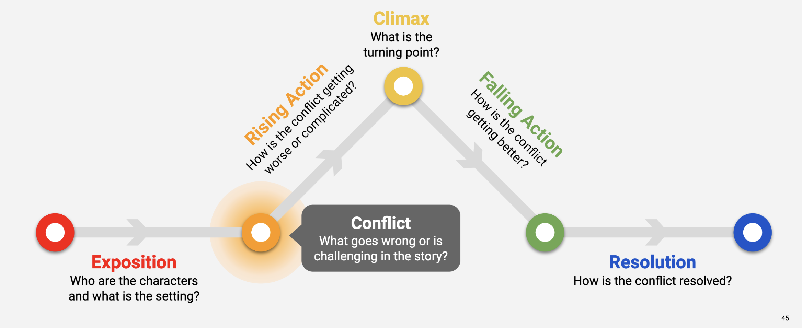

# FinTech Case Study
 - Juil

### Case Study Components
- Situation
- Solution Options
- Recommendation

## Situation
A **charity** organization had a successful fundraising campaign but is unable to track the delivery of funds to the correct recipients in developing nations.

How can the charity effectively distribute and accurately track donations?

### Problems
- Effective distribution
- Accurate tracking

## Technology Options

### Distribution
- Coca Cola distribution for small items

### Tracking
- Low power GPS
- Starlink
- Blockchain
- Twilio integration for banking and blockchain access

### Power
- Micro solar panel
- Hand crank generator

## Recommendation
Distribute donation via the Coca Cola distribution network. Include a low-power GPS and micro solar panel. Have recipients upload periodic updates to social media so that donors can track the success of donation and possibly donate more.
