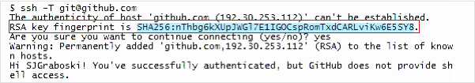

# SSH Keys

Check ssh keys.

`ls -al ~/.ssh`

Create new ssh key. Enter passphrase.

`ssh-keygen -t rsa -b 4096 -C "YOURGITHUB@EMAIL.NET"`

Test ssh-agent.

`eval "$(ssh-agent -s)"`

Add ssh key. Enter passphrase.

`ssh-add ~/.ssh/id_rsa`

Copy public key and add to Github.

`pbcopy < ~/.ssh/id_rsa.pub`

Add Github to list of acceptable SSH hosts.

`ssh -T git@github.com`

Check displayed fingerprint against [Github's public key fingerprints](https://docs.github.com/en/authentication/keeping-your-account-and-data-secure/githubs-ssh-key-fingerprints)

