# GitHub Practice 

In this activity, you will create a new project in GitHub and practice commonly used Git commands.

Git is a great resource for managing your code and very convenient if you want to change computers. You'll become very familiar with Git and GitHub over the course of this class.

## Instructions

1. Navigate to your GitHub page and create a new respository by clicking on the Repositories tab.

    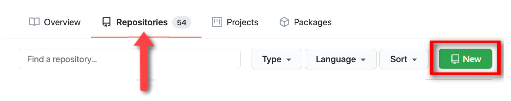

2. Create a new project named `git-practice`. Add a short description to the project, such as "practicing with git." Then, initialize the repository with a README and create the repository.

    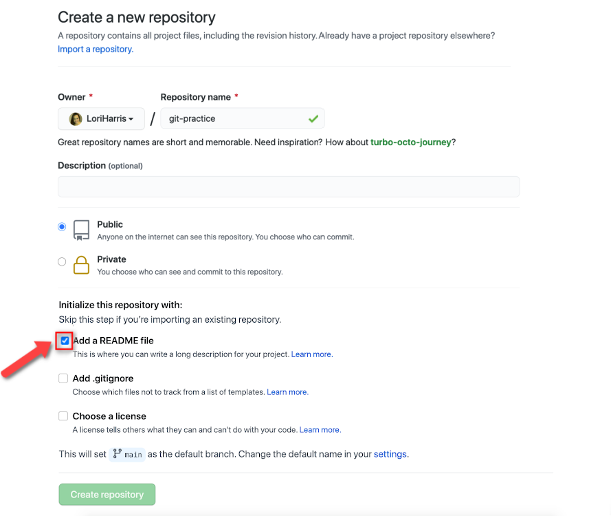

3. Clone the repository by clicking the `Code` button. Copy the link to your clipboard.

    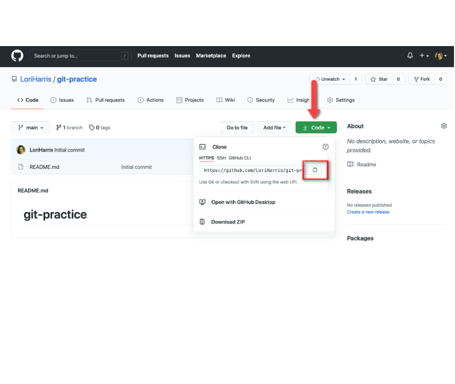

4. Navigate to the directory where you want to save your future coding drills––e.g., your desktop, root directory, or Documents folder. Open the command line in this folder, and run `git clone ` with the link you've copied. This will make a local copy of the repository.

    

5. Check the current status of the repository by running the `git status` command, which should tell you that you're completely up to date.

    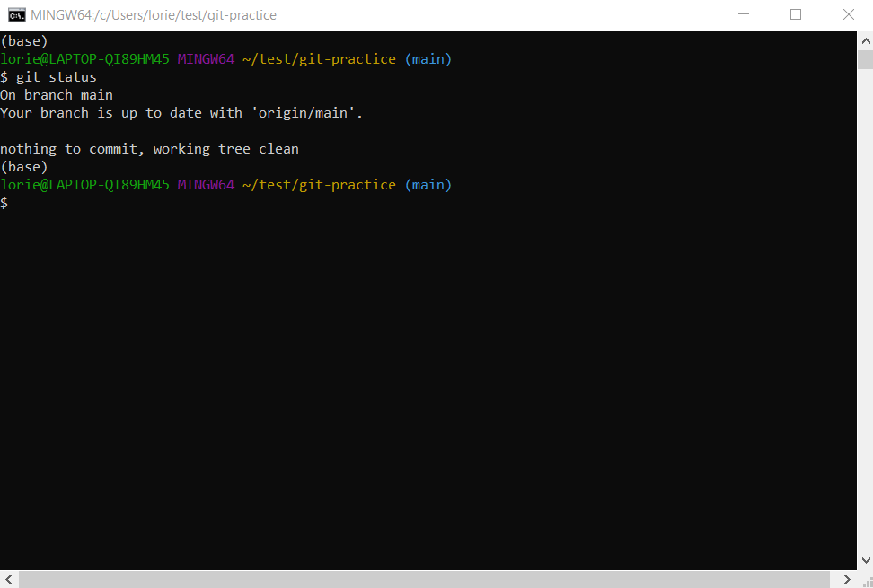

6. Create a new file named `test.md` and then check your `git status` again. Notice that Git is now showing you have an untracked file.

    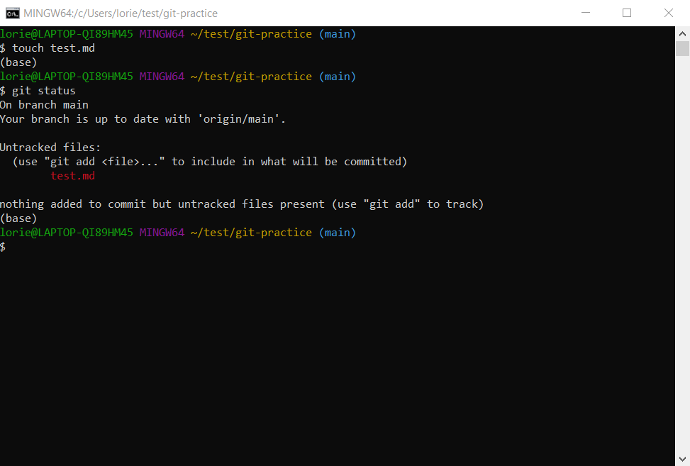

7. Use the  `git add .` command to add the contents of the current folder to be tracked by Git. The period by itself references the current directory. Now Git is waiting for those files to be committed.

    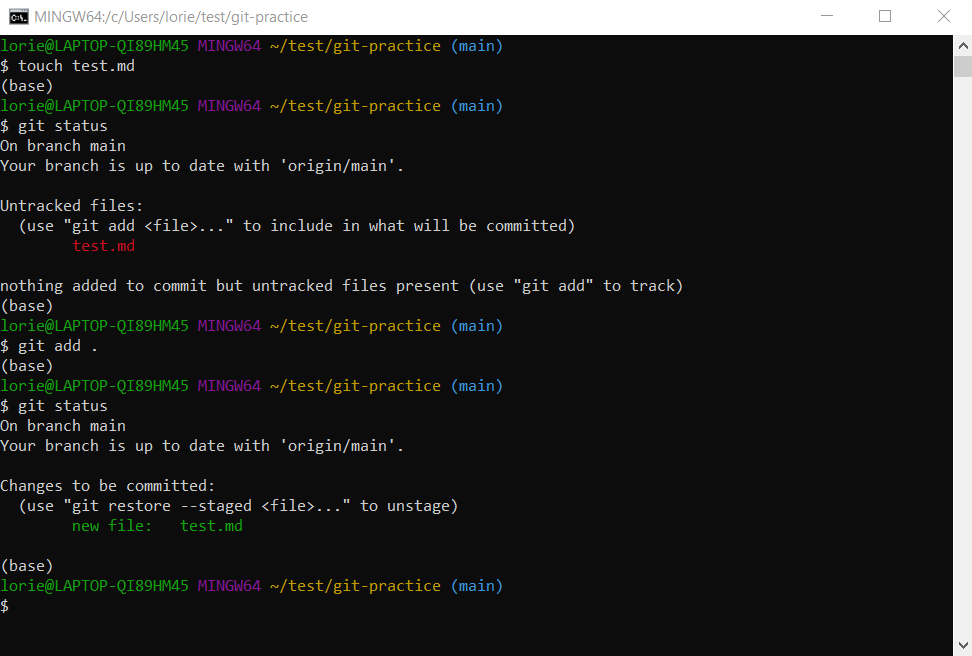

8. Commit the changes to the repository along with a commit message using the `git commit -m "add test file"` command. This creates a new commit with the "add test file" commit message.

    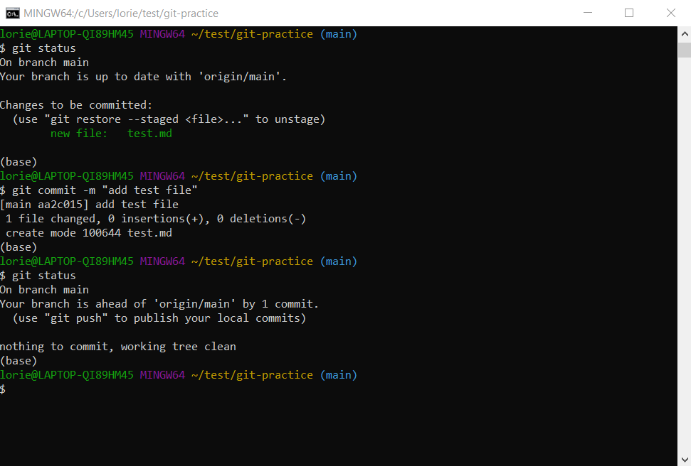

9. Push the changes to GitHub to sync your machine with GitHub. Use the `git push origin main` command.

    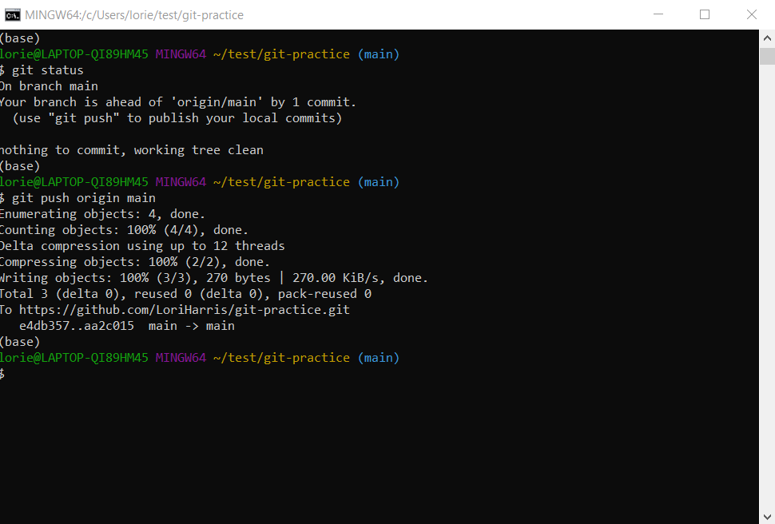

10. If you made changes to the repository on another computer, you can pull down the changes you've committed with the `git pull origin main` command. But since you haven't made any changes yet, Git will tell you that you're already up to date.

    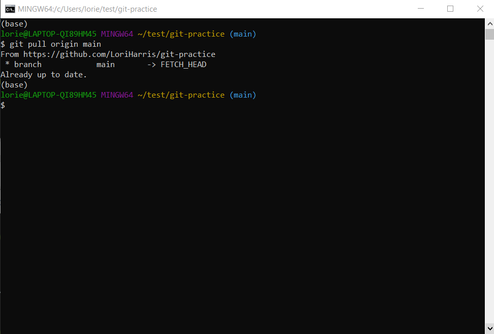

11. If you want to work on your project on another computer or from a different location, you can clone the repository from GitHub as we did in Step 4.

    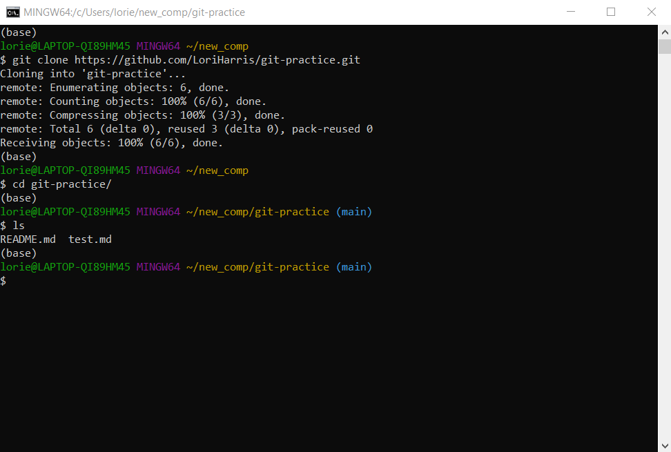

12. From the new location, you can make changes to the project and push those changes up to GitHub.

    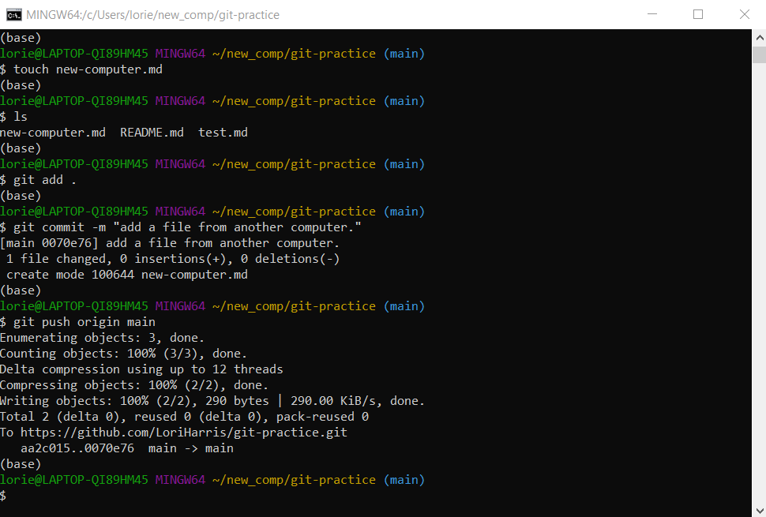

13. If you go back to your first directory, you can pull down the changes you made elsewhere. Navigate back to the directory you cloned in Step 4 and run `git pull origin main`.

    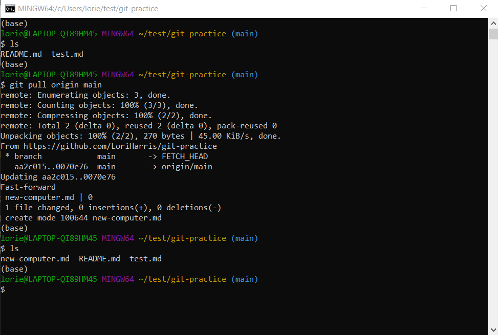

---

© 2022 edX Boot Camps LLC. Confidential and Proprietary. All Rights Reserved.
