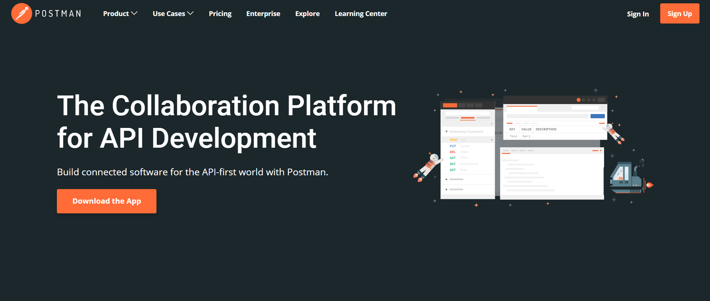
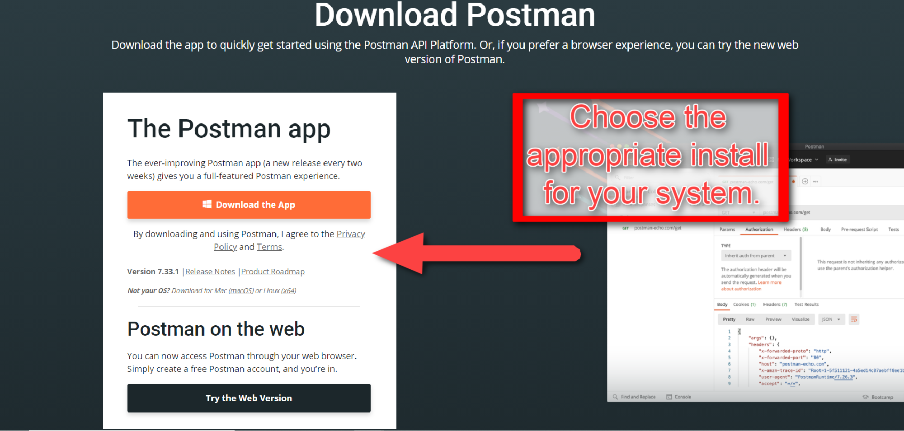
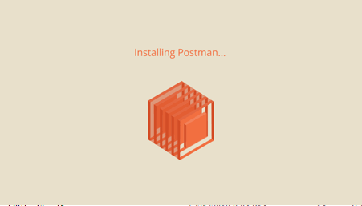

## Install and Sign up for Postman

This guide outlines the required steps to sign up for a `Postman` account and to download the `Postman` client.

1. Navigate to the [Postman](https://www.postman.com/downloads/) website.

2. Click download.

    

3. Choose the appropriate 64bit install for your operating system.

    

4. Save the download file. Once the download is complete, execute the download file.

    

5. Create a `Postman` account, or click cancel. `Postman` does not require users to have accounts.

---

© 2022 edX Boot Camps LLC. Confidential and Proprietary. All Rights Reserved.
